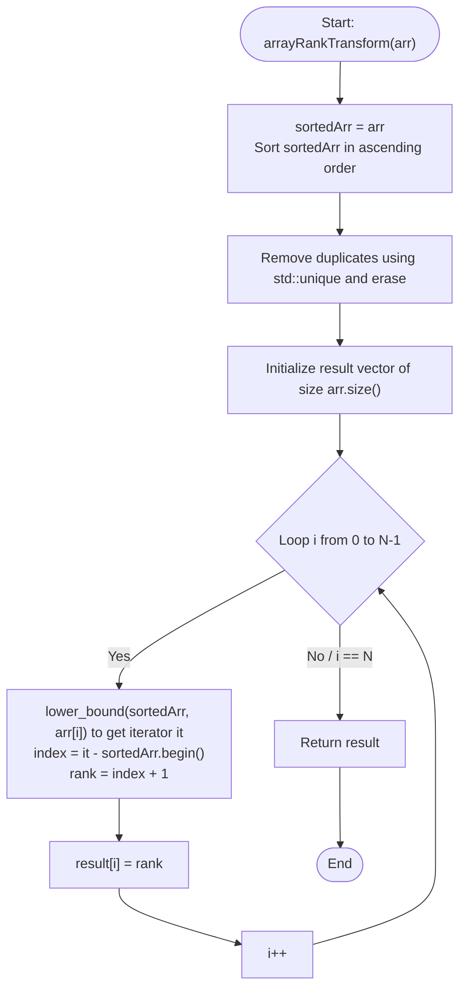

# 💡 Approach — Rank Transform of an Array

| 📄 [Problem](./Problem.md) | 💡 [Approach](./Approach.md) | 🧩 [Solution](./Solution.cpp) | 🚀 [Main](./Main.cpp) |
|:--------------------------:|:-----------------------------:|:------------------------------:|:---------------------:|

---

## 📊 Metadata

---

## 🎯 Core Insight

> [!TIP]
> **Sorted Unique Array + Binary Search Mapping**
>
> 1. **Rank Property:** The rank of an element corresponds directly to its relative size in the sorted list of *unique* elements in the array.
> 2. **Eliminating Map Overhead:** Instead of using an `std::unordered_map` (which incurs hashing overhead and potential worst-case $O(N^2)$ collision patterns), we can use a simpler, cache-friendly approach:
>    - Create a copy of the array and sort it.
>    - Remove all duplicates using `std::unique` and `std::vector::erase`.
>    - For each element in the original array, use binary search (`std::lower_bound`) to find its 0-indexed position in the sorted unique array.
>    - The rank is simply `position + 1`.
> 3. **Time-Space Tradeoffs:** This method runs in $O(N \log N)$ time and $O(N)$ auxiliary space, which is highly efficient and runs in deterministic time.

---

## 🔩 Step-by-Step Breakdown

**Step 1: Copy and Sort the Original Array**
- Create a duplicate array `sortedArr = arr`.
- Sort `sortedArr` in ascending order.

**Step 2: Remove Duplicates**
- Use `std::unique` to shift duplicates to the end.
- Erase the duplicate elements using `sortedArr.erase()` to find the set of sorted unique values.

**Step 3: Map Elements to Ranks**
- Create a result vector of size $N$.
- For each element $arr[i]$, perform a binary search using `std::lower_bound` on `sortedArr` to find the iterator pointing to $arr[i]$.
- The index of this element in `sortedArr` is `it - sortedArr.begin()`.
- The rank is `index + 1`. Store it in `result[i]`.

**Step 4: Return the Transformed Rank Array**
- Return the `result` vector.

---

## 🔄 Mermaid Flowchart

---

## 🧮 Dry Run — Example 1

- **Input:** $arr = [40, 10, 20, 30]$.
- **Step 1: Copy and Sort**
  - $sortedArr = [10, 20, 30, 40]$ (sorted).
- **Step 2: Remove Duplicates**
  - $sortedArr$ has no duplicates, remains: $[10, 20, 30, 40]$.
- **Step 3: Map Elements**
  - $arr[0] = 40 \implies \text{lower\_bound}(sortedArr, 40) \text{ is at index } 3 \implies rank = 3 + 1 = 4$.
  - $arr[1] = 10 \implies \text{lower\_bound}(sortedArr, 10) \text{ is at index } 0 \implies rank = 0 + 1 = 1$.
  - $arr[2] = 20 \implies \text{lower\_bound}(sortedArr, 20) \text{ is at index } 1 \implies rank = 1 + 1 = 2$.
  - $arr[3] = 30 \implies \text{lower\_bound}(sortedArr, 30) \text{ is at index } 2 \implies rank = 2 + 1 = 3$.
  - $result = [4, 1, 2, 3]$.
- **Return Result:** Return $[4, 1, 2, 3]$.

---

## 📊 Complexity Analysis

| Metric | Complexity | Reasoning |
| :---: | :---: | :--- |
| 🕐 Time | $$O(N \log N)$$ | Sorting the array takes $O(N \log N)$ time. Finding the rank for each of the $N$ elements takes $O(N \log U)$ where $U \le N$ is the count of unique elements. |
| 💾 Space | $$O(N)$$ | The algorithm requires $O(N)$ auxiliary space to store the sorted copy of the input array. |

---

> *"The best rank you can achieve is the one where you improve upon your own previous score."*

---

<h3>Happy Coding! 🚀</h3>

