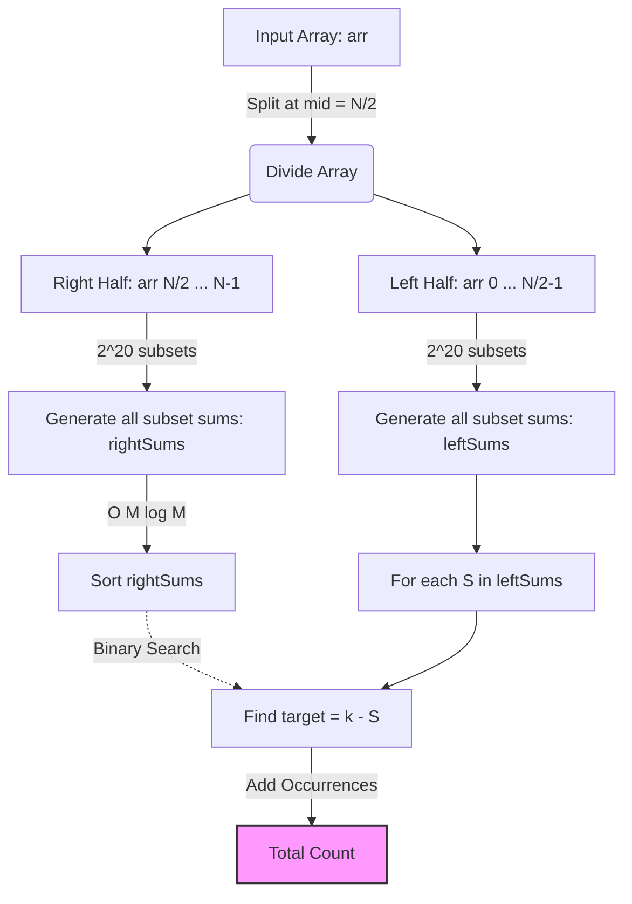

# Approach: Meet in the Middle

| 📄 [Problem](./Problem.md) | 💡 [Approach](./Approach.md) | 🧩 [Solution](./Solution.cpp) | 🚀 [Main](./Main.cpp) |
|:--------------------------:|:-----------------------------:|:------------------------------:|:---------------------:|

 

## Intuition

The problem requires us to find the count of subsets that sum up to a target `k`. 
Standard Dynamic Programming (0/1 Knapsack) takes $O(N \times \text{Sum})$ time and space. However, in this problem, the elements can be negative and the target $k$ can be as large as $10^7$, making the sum range too large for traditional DP using an array.

Notice the constraint: $N \le 40$. 
An $O(2^N)$ brute force approach is too slow for $N = 40$ since $2^{40}$ operations will result in a Time Limit Exceeded (TLE). However, $O(2^{N/2})$ is very much feasible since $2^{20} \approx 10^6$. This observation perfectly aligns with the **Meet in the Middle** algorithm! We can divide the array into two halves, compute all subset sums for each half, and then combine the results.

## Algorithm

1. **Divide the Array**: Split the input array `arr` into two halves. 
   - **Left half**: `arr[0]` to `arr[N/2 - 1]`
   - **Right half**: `arr[N/2]` to `arr[N - 1]`
2. **Generate Subset Sums**:
   - Compute all possible subset sums for the left half and store them in `leftSums`. Its size will be exactly $2^{\lfloor N/2 \rfloor}$.
   - Compute all possible subset sums for the right half and store them in `rightSums`. Its size will be exactly $2^{\lceil N/2 \rceil}$.
3. **Sort for Fast Lookup**: Sort the `rightSums` array. This enables us to use binary search for finding matching sums.
4. **Meet in the Middle**:
   - Iterate through each sum $S_{left}$ in `leftSums`.
   - To form the overall target sum $k$, we need a corresponding sum $S_{right} = k - S_{left}$ from the right half.
   - Use binary search (via `std::equal_range` in C++) on the sorted `rightSums` to count how many times $S_{right}$ appears.
   - Add this count to our total subset answer.

## Visual Representation

## Complexity Analysis

- **Time Complexity:** $O(2^{N/2} \cdot \log(2^{N/2}))$
  Generating the subsets takes $O(2^{N/2})$. Sorting the `rightSums` takes $O(2^{N/2} \cdot \log(2^{N/2}))$. The search step also takes identical time. Thus, the overall time complexity is heavily bound by the sorting and searching phases, comfortably passing the $1$ second time limit for $N \le 40$.
- **Space Complexity:** $O(2^{N/2})$
  We store the subset sums for both halves in vectors, which require up to $2^{20} \approx 10^6$ elements. This comfortably fits within memory limits.

---

Happy Coding! 🚀  

