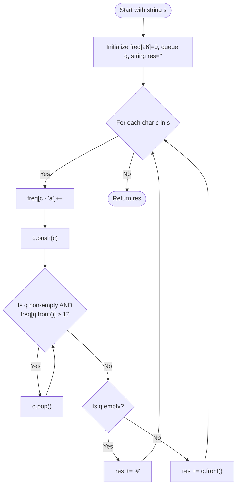

# Approach: First Non-repeating Character in a Stream

<div align="center">
  
[**Problem.md**](./Problem.md) • [**Solution.cpp**](./Solution.cpp) • [**Main.cpp**](./Main.cpp)

</div>

<br>

## 🧠 Intuition

The problem requires us to find the first non-repeating character in a stream of characters as we iterate through a string. 
A naive approach would be to check the prefix string for non-repeating characters at every step, which would result in $O(N^2)$ time complexity. 

To optimize this to **$O(N)$**, we can use a **Queue** and a **Frequency Array**:
1. **Queue:** Helps maintain the order of characters as they appear in the stream.
2. **Frequency Array:** Helps track the frequency of each character in $O(1)$ time. 
Since there are only 26 lowercase English alphabets, an array of size 26 is sufficient.

As we process each character:
- We increment its count in the frequency array.
- We push it into the queue.
- We then check the front of the queue. If the front character has a frequency greater than 1, it's repeating, so we pop it from the queue. We keep popping until the front is a non-repeating character or the queue is empty.
- If the queue becomes empty, append `'#'` to the result. Otherwise, append the character at the front of the queue.

---

## 🛠️ Step-by-Step Algorithm

1. Initialize a `result` string to store the answer.
2. Initialize an integer array `freq` of size `26` with all zeros to track character frequencies.
3. Initialize an empty queue `q` to maintain the sequence of characters.
4. Iterate through each character `c` in the string `s`:
    - Increment the frequency of `c`: `freq[c - 'a']++`.
    - Push `c` to the queue `q`.
    - Loop while `q` is not empty and the frequency of the front element is `> 1` (`freq[q.front() - 'a'] > 1`):
        - Pop from the queue `q.pop()`.
    - If `q` is empty, append `'#'` to `result`.
    - Else, append `q.front()` to `result`.
5. Return the `result` string.

---

## 📊 Visual Representation



---

## 💻 Code Structure

### 1️⃣ Complexity Analysis

- **Time Complexity:** $O(N)$
  - We iterate through the string of length $N$.
  - Although there is a `while` loop inside the `for` loop, each character is pushed into the queue at most once and popped at most once. Hence, the total queue operations take $O(N)$ time over the entire string.
  - Overall time complexity is $O(N)$.
  
- **Space Complexity:** $O(N)$ or $O(1)$
  - The frequency array takes $O(26)$ space, which is $O(1)$.
  - In the worst case (all unique characters), the queue can store up to $N$ characters, taking $O(N)$ space.
  - However, since there are only 26 distinct characters, the queue will store at most 26 elements at any given time. Thus, the effective space complexity is $O(1)$.

---

### 2️⃣ C++ Implementation

```cpp
// Check Solution.cpp for the complete C++ implementation
```
