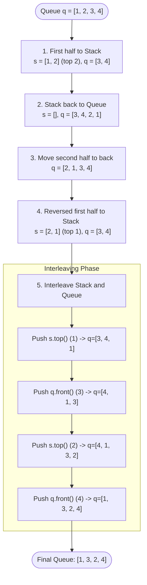

# Approach: Interleave First Half of the Queue with Second Half

<div align="center">
  
[**Problem.md**](./Problem.md) • [**Solution.cpp**](./Solution.cpp) • [**Main.cpp**](./Main.cpp)

</div>

<br>

## 🧠 Intuition

The problem requires us to interleave the first half of a given even-sized queue with its second half. The constraint is that we can only use standard queue operations (`push`, `pop`, `front`) and an auxiliary Stack. 

Since a queue is FIFO (First-In-First-Out) and a stack is LIFO (Last-In-First-Out), pushing elements from the queue to the stack and back will naturally reverse their order. To maintain the original relative order of the first half while allowing interleaving from the front of the sequence, we need to carefully reverse the first half, move the second half behind it, and reverse the first half again. 

**Logic Flow:**
1. **Push first half to stack:** This stores the first half, but the top of the stack is the middle element.
2. **Enqueue stack back to queue:** This puts the first half at the back of the queue, but in reverse order.
3. **Dequeue and enqueue the original second half:** This moves the second half (which was at the front) to the back of the queue, exposing our reversed first half at the front again.
4. **Push reversed first half to stack:** This puts the first half back into the stack, but because it was already reversed, the stack top now correctly holds the very first element of the queue!
5. **Interleave:** Now, `s.top()` has the first half in correct order, and `q.front()` has the second half in correct order. We alternately push `s.top()` and `q.front()` to the queue.

---

## 🛠️ Step-by-Step Algorithm

1. Find the size of the queue $N$ and calculate `half = N / 2`.
2. Push the first `half` elements from the queue into the stack.
3. Pop from the stack and push back into the queue. (First half is now reversed at the back).
4. Pop the next `half` elements (which were originally the second half) from the front of the queue and push them directly back to the rear of the queue.
5. Pop the first `half` elements from the queue (which are the reversed first half) and push them into the stack.
6. Now the stack has the first half elements with the very first element at the top, and the queue has the second half elements at its front.
7. Interleave by alternately popping from the stack and queue, and pushing them to the back of the queue.

---

## 📊 Visual Representation



---

## 💻 Code Structure

### 1️⃣ Complexity Analysis

- **Time Complexity:** $\mathcal{O}(N)$
  - We perform a series of operations proportional to $N/2$. Specifically, 5 distinct loops of size $N/2$. Total time is linear $\mathcal{O}(N)$.
- **Space Complexity:** $\mathcal{O}(N)$
  - We use an auxiliary stack of size $N/2$, which takes linear extra space $\mathcal{O}(N)$.

---

### 2️⃣ C++ Implementation

```cpp
// Check Solution.cpp for the complete C++ implementation
```

---

<div align="center">
Happy Coding! 🚀 <br>
<a href="https://x.com/PankajB42550" target="_blank">
  
</a>
</div>
