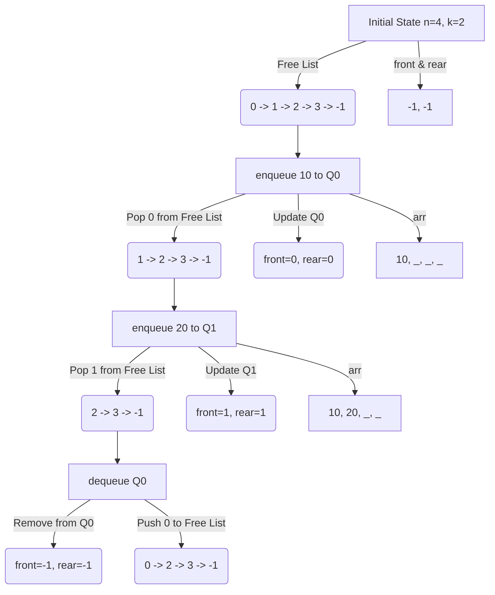

# Approach: N Queues in an Array

  <a href="./Problem.md"><b>Problem</b></a> •
  <a href="./Solution.cpp"><b>Solution</b></a> •
  <a href="./Main.cpp"><b>Main</b></a>

 

To implement `k` queues in a single array of size `n` effectively (i.e., using space only when needed), we can't simply divide the array into `k` fixed segments. Doing so would lead to space wastage if one queue is full but others are empty.

Instead, we use a **dynamic** approach similar to implementing `k` stacks in an array or a linked list implementation using arrays.

## Data Structures

We need the following arrays/variables:

1.  **`arr[n]`**: The main array to store the actual elements of the queues.
2.  **`front[k]`**: `front[i]` stores the index of the front element of the `i`-th queue. Initialize all with `-1`.
3.  **`rear[k]`**: `rear[i]` stores the index of the rear element of the `i`-th queue. Initialize all with `-1`.
4.  **`next[n]`**: This array serves two purposes:
    - **For occupied slots**: `next[i]` stores the index of the _next_ item in the queue (like a "next" pointer in a linked list).
    - **For free slots**: `next[i]` stores the index of the _next_ free slot in the array.
    - Initialize `next[i] = i + 1` for `0 <= i < n-1` and `next[n-1] = -1` (indicating end of free list).
5.  **`freeSpot`**: Stores the index of the first available free slot in the array. Initialize to `0`.

## Visualizing the Concept

## Algorithms

### 1. `enqueue(x, qi)`

- **Check Overflow**: If `freeSpot == -1`, the array is full. Return `false` (or handle as specified).
- **Find Free Slot**: Let `index = freeSpot`.
- **Update Free Spot**: `freeSpot = next[index]`.
- **Update Queue**:
  - if queue `qi` is empty (`front[qi] == -1`), set `front[qi] = index`.
  - else (`rear[qi] != -1`), link the old rear to the new element: `next[rear[qi]] = index`.
- **Update Rear**: `rear[qi] = index`.
- **Update Next**: `next[index] = -1` (since it's now the last element).
- **Store Element**: `arr[index] = x`.

### 2. `dequeue(qi)`

- **Check Underflow**: If `front[qi] == -1`, the queue is empty. Return `-1`.
- **Get Index**: `index = front[qi]`.
- **Update Front**: `front[qi] = next[index]`. (Move front to the next element).
- **Recycle Slot**:
  - `next[index] = freeSpot` (Link this slot back to the free list).
  - `freeSpot = index` (Update freeSpot to this slot).
- Return `arr[index]`.

### 3. `isEmpty(qi)`

- Return `true` if `front[qi] == -1`.

### 4. `isFull()`

- Return `true` if `freeSpot == -1`.

## Complexity Analysis

- **Time Complexity**: $O(1)$ for all operations (`enqueue`, `dequeue`, `isEmpty`, `isFull`).
- **Space Complexity**: $O(n + k)$ for storing the arrays (`next`, `front`, `rear`).
