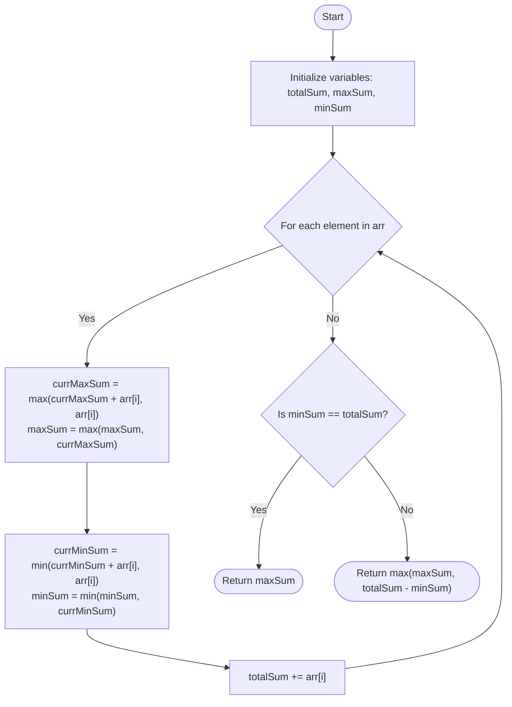

# Approach: Kadane's Algorithm for Max Circular Subarray Sum

  <a href="./Problem.md"><strong>Problem Statement</strong></a> |
  <a href="./Solution.cpp"><strong>Solution.cpp</strong></a> |
  <a href="./Main.cpp"><strong>Main.cpp</strong></a>

 

## 💡 Intuition

The problem asks us to find the maximum possible sum of a contiguous subarray, but the array is circular. This means the subarray can wrap around from the end of the array to the beginning.

There are two possibilities for the maximum subarray sum:
1. **Normal Subarray:** The maximum subarray does not wrap around. This is the standard "Maximum Subarray Sum" problem, which can be solved using **Kadane's Algorithm** to find `maxSum`.
2. **Circular Subarray:** The maximum subarray wraps around. This means the elements *not* included in the subarray form a normal, contiguous subarray. To maximize the circular subarray, we need to minimize the non-included normal subarray. We can use Kadane's algorithm to find the minimum subarray sum (`minSum`). The maximum circular sum is then `totalSum - minSum`.

**Edge Case:** If all elements in the array are negative, `totalSum` will be equal to `minSum`, and `totalSum - minSum` will evaluate to `0` (which is incorrect because we must select at least one element). In this case, the answer should just be the maximum single element, which is the `maxSum`.

## 🛠️ Algorithm

1. Initialize `totalSum`, `currMaxSum`, `currMinSum` to `0`.
2. Initialize `maxSum` and `minSum` to the first element `arr[0]`.
3. Iterate through each element in the array:
   - Apply Kadane's to update the maximum subarray sum (`maxSum`).
   - Apply Kadane's to update the minimum subarray sum (`minSum`).
   - Add the current element to `totalSum`.
4. Check if all numbers are negative:
   - If `totalSum == minSum`, it implies all elements are negative. Return `maxSum`.
5. Otherwise, return the maximum of `maxSum` and `totalSum - minSum`.

## 📊 Visual Representation

## ⏳ Complexity Analysis

- **Time Complexity:** $\mathcal{O}(N)$. We traverse the array exactly once, performing constant time operations at each step.
- **Space Complexity:** $\mathcal{O}(1)$. We only use a few variables (`maxSum`, `minSum`, `currMaxSum`, `currMinSum`, `totalSum`) to keep track of the sums, which requires constant extra space.

## 🚶‍♂️ Example Walkthrough

**Input:** `arr = [8, -8, 9, -9, 10, -11, 12]`

| Step (`i`) | `arr[i]` | `currMaxSum` | `maxSum` | `currMinSum` | `minSum` | `totalSum` |
| :---: | :---: | :---: | :---: | :---: | :---: | :---: |
| Init | - | 0 | 8 | 0 | 8 | 0 |
| 0 | 8 | 8 | 8 | 8 | 8 | 8 |
| 1 | -8 | 0 | 8 | -8 | -8 | 0 |
| 2 | 9 | 9 | 9 | 1 | -8 | 9 |
| 3 | -9 | 0 | 9 | -8 | -8 | 0 |
| 4 | 10 | 10 | 10 | 2 | -8 | 10 |
| 5 | -11 | -1 | 10 | -9 | -9 | -1 |
| 6 | 12 | 12 | 12 | 3 | -9 | 11 |

- `maxSum` (normal) = `12`
- `minSum` = `-9`
- `totalSum` = `11`
- Circular Max Sum = `totalSum - minSum` = `11 - (-9)` = `20`
Wait, for this example the output should be `22`. Let's re-trace.

Re-tracing Example 1 correctly:
`currMaxSum` resets and adds:
i=0, v=8: max(8,8)=8, maxS=8 | minS=8, tot=8
i=1, v=-8: max(0,-8)=0, maxS=8 | min(-8,-8)=-8, minS=-8, tot=0
i=2, v=9: max(9,9)=9, maxS=9 | min(1,9)=1, minS=-8, tot=9
i=3, v=-9: max(0,-9)=0, maxS=9 | min(-8,-9)=-9, minS=-9, tot=0
i=4, v=10: max(10,10)=10, maxS=10 | min(1,10)=1, minS=-9, tot=10
i=5, v=-11: max(-1,-11)=-1, maxS=10 | min(-10,-11)=-11, minS=-11, tot=-1
i=6, v=12: max(11,12)=12, maxS=12 | min(1,12)=1, minS=-11, tot=11

- `maxSum` = 12
- `minSum` = -11
- `totalSum` = 11
- Circular Max Sum = `11 - (-11) = 22`.

Result: `max(12, 22) = 22`.
