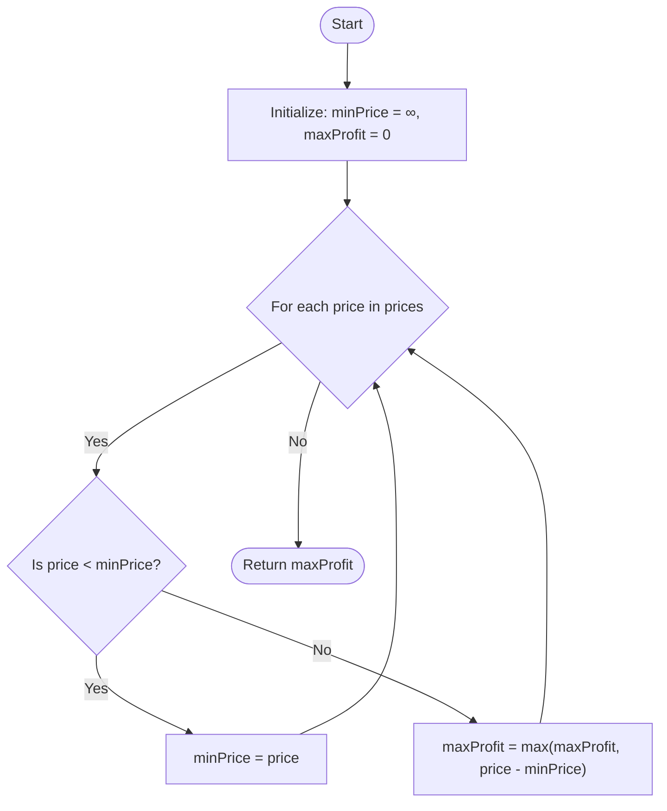

# Approach: Track Minimum Price

  <a href="./Problem.md"><strong>Problem Statement</strong></a> |
  <a href="./Solution.cpp"><strong>Solution.cpp</strong></a> |
  <a href="./Main.cpp"><strong>Main.cpp</strong></a>

 

## 💡 Intuition

The problem requires us to find the maximum profit from buying and selling a stock exactly once. To maximize the profit, we need to buy at the lowest possible price and sell at the highest possible price *after* the buy day.

Instead of comparing every possible pair of buy and sell days (which would take $\mathcal{O}(N^2)$ time), we can maintain the **minimum price seen so far** as we iterate through the array. For each day, we can calculate the potential profit if we sold the stock on that day (i.e., `current_price - min_price`). We then update the maximum profit if this potential profit is greater than the previous maximum.

## 🛠️ Algorithm

1. Initialize `minPrice` to a very large value (e.g., `INT_MAX`) to track the lowest stock price seen so far.
2. Initialize `maxProfit` to `0` to keep track of the maximum profit.
3. Iterate through each `price` in the `prices` array:
   - **Update Minimum Price:** If `price < minPrice`, update `minPrice = price`. We found a new, better day to buy.
   - **Calculate Profit:** Otherwise, if the price is greater than `minPrice`, calculate the profit if we sell today: `profit = price - minPrice`.
   - **Update Maximum Profit:** Update `maxProfit = max(maxProfit, profit)`.
4. After traversing the array, return `maxProfit`.

## 📊 Visual Representation

## ⏳ Complexity Analysis

- **Time Complexity:** $\mathcal{O}(N)$. We iterate through the `prices` array exactly once, performing constant time operations at each step.
- **Space Complexity:** $\mathcal{O}(1)$. We only use a few integer variables (`minPrice` and `maxProfit`), requiring constant extra space.

## 🚶‍♂️ Example Walkthrough

**Input:** `prices = [7, 10, 1, 3, 6, 9, 2]`

| Step (`i`) | `price` | `minPrice` | Calculation | `maxProfit` |
| :---: | :---: | :---: | :--- | :---: |
| Init | - | $\infty$ | - | 0 |
| 0 | 7 | 7 | `7 < ∞` (Update min) | 0 |
| 1 | 10 | 7 | `10 > 7` -> Profit = `10 - 7 = 3` | 3 |
| 2 | 1 | 1 | `1 < 7` (Update min) | 3 |
| 3 | 3 | 1 | `3 > 1` -> Profit = `3 - 1 = 2` | 3 |
| 4 | 6 | 1 | `6 > 1` -> Profit = `6 - 1 = 5` | 5 |
| 5 | 9 | 1 | `9 > 1` -> Profit = `9 - 1 = 8` | 8 |
| 6 | 2 | 1 | `2 > 1` -> Profit = `2 - 1 = 1` | 8 |

**Final Output:** `8`

---

Happy Coding! 🚀  

