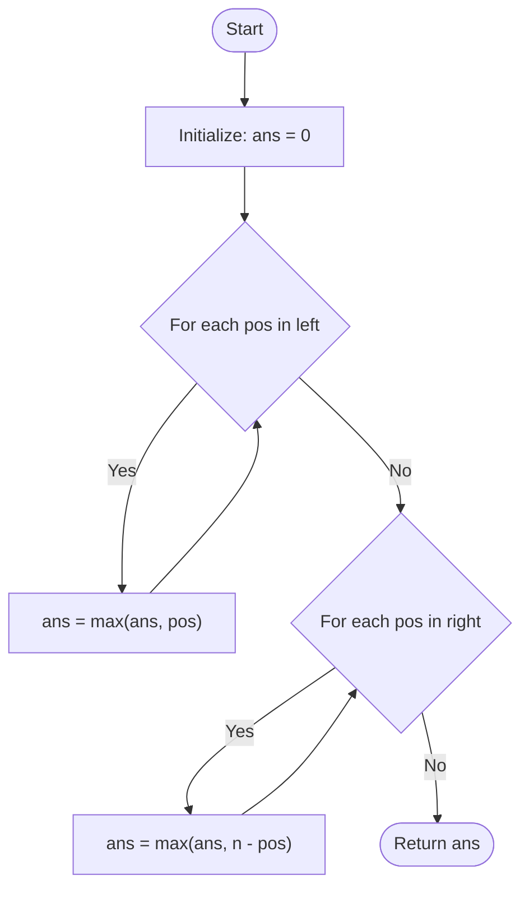

# Approach: Mathematical / Brainteaser

  <a href="./Problem.md"><strong>Problem Statement</strong></a> |
  <a href="./Solution.cpp"><strong>Solution.cpp</strong></a> |
  <a href="./Main.cpp"><strong>Main.cpp</strong></a>

 

## 💡 Intuition

The key to solving this problem efficiently is a simple **brainteaser** observation.

When two ants meet and change directions, they essentially **"pass through"** each other. Think about it: if Ant A is moving right and Ant B is moving left, and they collide, Ant A starts moving left and Ant B starts moving right. However, since all ants are identical and move at the exact same speed (1 unit/second), it's completely equivalent to pretend that **they never collided at all** and simply continued walking through each other in their original directions!

Because of this property, we can completely ignore collisions. 
We just need to find the maximum time any single ant takes to fall off the plank assuming it walks straight to its respective edge.

- For an ant moving **left** starting at position `pos`, it takes `pos` seconds to reach `0`.
- For an ant moving **right** starting at position `pos`, it takes `n - pos` seconds to reach `n`.

The last moment before all ants fall is the **maximum** of all these times.

## 🛠️ Algorithm

1. Initialize a variable `ans` to `0`.
2. Iterate through all positions in the `left` array:
   - For each `pos`, update `ans = max(ans, pos)`.
3. Iterate through all positions in the `right` array:
   - For each `pos`, update `ans = max(ans, n - pos)`.
4. Return `ans` as the final result.

## 📊 Visual Representation

## ⏳ Complexity Analysis

- **Time Complexity:** $\mathcal{O}(L + R)$, where $L$ is the number of ants moving left and $R$ is the number of ants moving right. We iterate over both arrays exactly once.
- **Space Complexity:** $\mathcal{O}(1)$. We only use a single variable `ans` to keep track of the maximum time, requiring constant extra space.

## 🚶‍♂️ Example Walkthrough

**Input:** `n = 4, left = [4, 3], right = [0, 1]`

1. Initial `ans = 0`.
2. **Process `left`:**
   - Ant at `pos = 4`: takes `4` seconds to reach 0. `ans = max(0, 4) = 4`.
   - Ant at `pos = 3`: takes `3` seconds to reach 0. `ans = max(4, 3) = 4`.
3. **Process `right`:**
   - Ant at `pos = 0`: takes `4 - 0 = 4` seconds to reach 4. `ans = max(4, 4) = 4`.
   - Ant at `pos = 1`: takes `4 - 1 = 3` seconds to reach 4. `ans = max(4, 3) = 4`.
4. **Final output:** `4`.

---

Happy Coding! 🚀  

