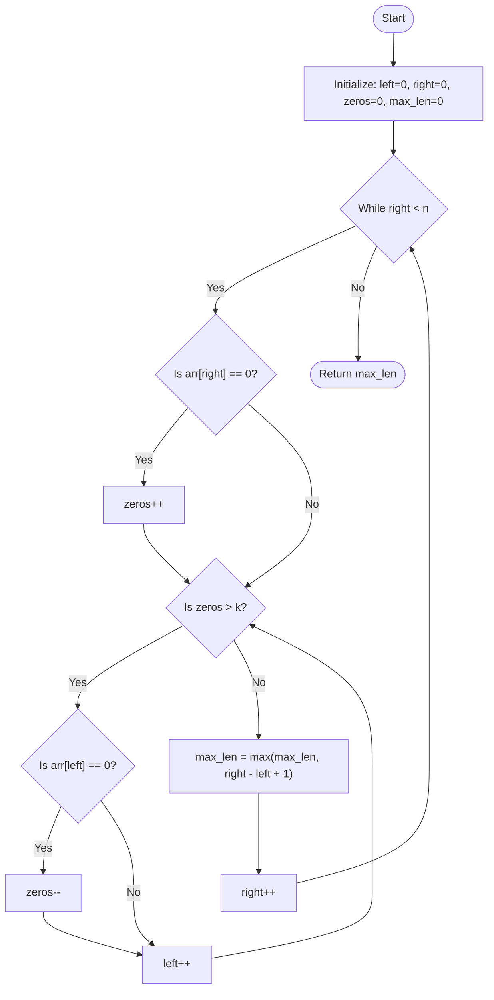

# Approach: Sliding Window / Two Pointers

  <a href="./Problem.md"><strong>Problem Statement</strong></a> |
  <a href="./Solution.cpp"><strong>Solution.cpp</strong></a> |
  <a href="./Main.cpp"><strong>Main.cpp</strong></a>

 

## 💡 Intuition

The problem asks for the longest contiguous subarray containing only `1`s, given that we can flip at most `k` `0`s to `1`s. 

Instead of generating all possible subarrays, which would take $\mathcal{O}(N^2)$ time, we can use a **Sliding Window (Two Pointers)** approach to find the maximum length efficiently. 
The core idea is to maintain a window `[left, right]` that expands as long as the number of `0`s inside the window is $\le k$.

- We expand our window by moving the `right` pointer and keeping track of the number of `0`s.
- If the number of `0`s exceeds `k`, the window becomes invalid. We must then shrink the window by moving the `left` pointer forward until the number of `0`s in the window is back to $\le k$.
- At each valid state, we calculate the length of the window `(right - left + 1)` and update our maximum length.

## 🛠️ Algorithm

1. Initialize `left = 0`, `right = 0`.
2. Initialize `zeros = 0` to count the number of `0`s in the current window.
3. Initialize `max_len = 0` to store the maximum consecutive `1`s found.
4. Iterate `right` through the array from `0` to `n - 1`:
   - If `arr[right] == 0`, increment `zeros`.
   - **While** `zeros > k`, it means the window is invalid. Shrink it from the left:
     - If `arr[left] == 0`, decrement `zeros`.
     - Increment `left`.
   - Update `max_len = max(max_len, right - left + 1)`.
5. Return `max_len`.

## 📊 Visual Representation

## ⏳ Complexity Analysis

- **Time Complexity:** $\mathcal{O}(N)$. Both the `left` and `right` pointers only move forward. Each element is processed at most twice (once by `right`, once by `left`).
- **Space Complexity:** $\mathcal{O}(1)$. We only use a few integer variables to maintain the pointers and counters.

## 🚶‍♂️ Example Walkthrough

**Input:** `arr = [1, 0, 1]`, `k = 1`

| `right` | `arr[right]` | `zeros` | `left` | Valid Window? (`zeros <= k`) | `max_len` |
| :---: | :---: | :---: | :---: | :---: | :---: |
| 0 | 1 | 0 | 0 | Yes | `max(0, 0-0+1) = 1` |
| 1 | 0 | 1 | 0 | Yes | `max(1, 1-0+1) = 2` |
| 2 | 1 | 1 | 0 | Yes | `max(2, 2-0+1) = 3` |

**Final Output:** `3`

---

Happy Coding! 🚀  

