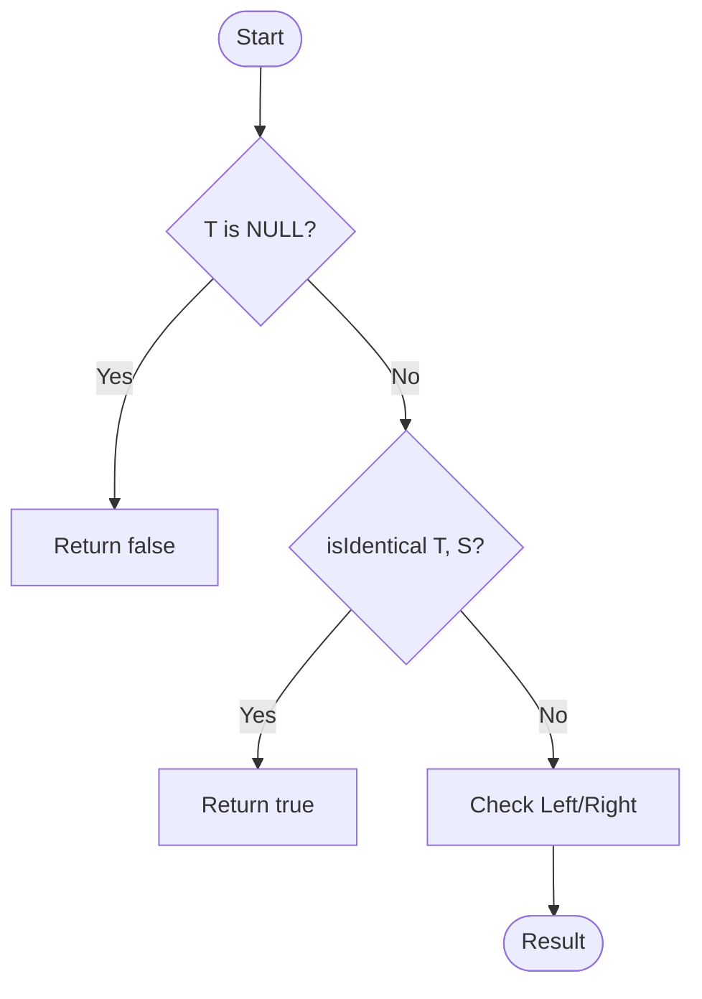

# [Approach - Check if subtree](Problem.md)
---

## 🔗 Navigation

| [📝 Problem](Problem.md) | [💡 Approach](Approach.md) | [💻 Solution](Solution.cpp) | [🚀 Main](Main.cpp) |
| :-------------------------------------------------------------------------------------------------: | :---------------------------------------------------------------------------------------------------: | :----------------------------------------------------------------------------------------------------: | :--------------------------------------------------------------------------------------------: |

---

> [!TIP]
> "Recursion is the root of all elegant tree solutions. Every subtree is a story waiting to be told."

---

## Problem Understanding

The goal is to determine if a binary tree `S` is a subtree of another binary tree `T`. A subtree means that there exists a node in `T` such that the subtree rooted at that node is exactly the same as `S` in terms of structure and node values.

---

## Algorithm

The problem can be broken down into two main recursive tasks:

1.  **Check Identity:** A helper function `isIdentical(root1, root2)` to check if two trees are identical.
2.  **Search Subtree:** A main function `isSubTree(T, S)` to traverse tree `T` and call `isIdentical` for each node in `T` as a potential root for `S`.

### Step-by-Step Logic:

1.  **Base Cases for `isSubTree(T, S)`:**
    - If `S` is `NULL`, it's a subtree (return `true`).
    - If `T` is `NULL` but `S` is not, it cannot be a subtree (return `false`).
2.  **Recursive Step:**
    - If `isIdentical(T, S)` is `true`, then `S` is a subtree of `T`.
    - Otherwise, check if `S` is a subtree of `T->left` OR `S` is a subtree of `T->right`.

### Base Cases for `isIdentical(r1, r2)`:

- Both `r1` and `r2` are `NULL` -> `true`.
- One is `NULL`, other is not -> `false`.
- `r1->data != r2->data` -> `false`.
- Recurse: `isIdentical(r1->left, r2->left) && isIdentical(r1->right, r2->right)`.

---

## Visual Representation

### Tree T and S Visualization

### Recursive Logic Flow

---

## Complexity Analysis

- **Time Complexity:** $O(N \times M)$
  - In the worst case, for every node in tree $T$ (N nodes), we might perform an identity check against tree $S$ (M nodes).
- **Space Complexity:** $O(H_T)$
  - $H_T$ is the height of tree $T$. This is due to the recursion stack depth.

---

> "Character is like a tree and reputation like its shadow. The shadow is what we think of it; the tree is the real thing." — **Abraham Lincoln**

---
