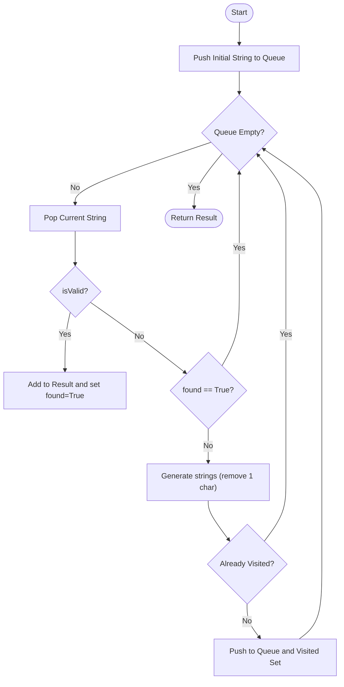

# Approach - Remove Invalid Parentheses (BFS)

| [Problem.md](Problem.md) | [Approach.md](Approach.md) | [Solution.cpp](Solution.cpp) | [Main.cpp](Main.cpp) |
| :---: | :---: | :---: | :---: |

---
> [!TIP]
> Breadth-First Search (BFS) is inherently suited for finding the "shortest path" or "minimum steps." By exploring strings level by level (where each level represents a number of removals), the first level that contains any valid strings will contain all valid strings with the minimum number of removals.

---

## Technical Breakdown

### 1. Level-by-Level Exploration (BFS)
We use a queue to store strings to be processed.
- **Initial State**: Push the original string `s` into the queue and mark it as visited.
- **Level Processing**: While the queue is not empty, we process all strings at the current level.
- **Minimum Removals**: As soon as we find a valid string at any level, we set a flag `found = true`. We continue processing the remaining strings at the *same* level (to find all possible valid strings with that many removals) but stop generating children for the *next* level.

### 2. State Generation
For each string `curr` pulled from the queue:
1. **Validity Check**: Use `isValid(curr)` to check if parentheses are balanced.
2. **Success**: If valid, add to the results.
3. **Branching**: If no valid string has been found yet at this or any previous level:
   - Iterate through every character in `curr`.
   - If the character is a parenthesis (`(` or `)`), create a new string by removing it.
   - If this new string hasn't been visited, add it to the queue and the visited set.

### 3. Space and Time Trade-offs
Using a `visited` set (typically an `unordered_set`) is crucial to avoid redundant processing of the same string arrived at via different removal paths.

---

## Visual Representation

---

## Complexity Analysis

- **Time Complexity:** $O(N \cdot 2^N)$
  In the worst case, we might explore all possible substrings. Each substring check `isValid` takes $O(N)$.
- **Auxiliary Space:** $O(2^N)$
  We store visited strings in a hash set to avoid cycles and redundant work, which can grow exponentially in the worst case.

---

> "Sometimes the broadest search reveals the closest answer."
> — *BFS Wisdom*

---

Happy Coding! 🚀  

