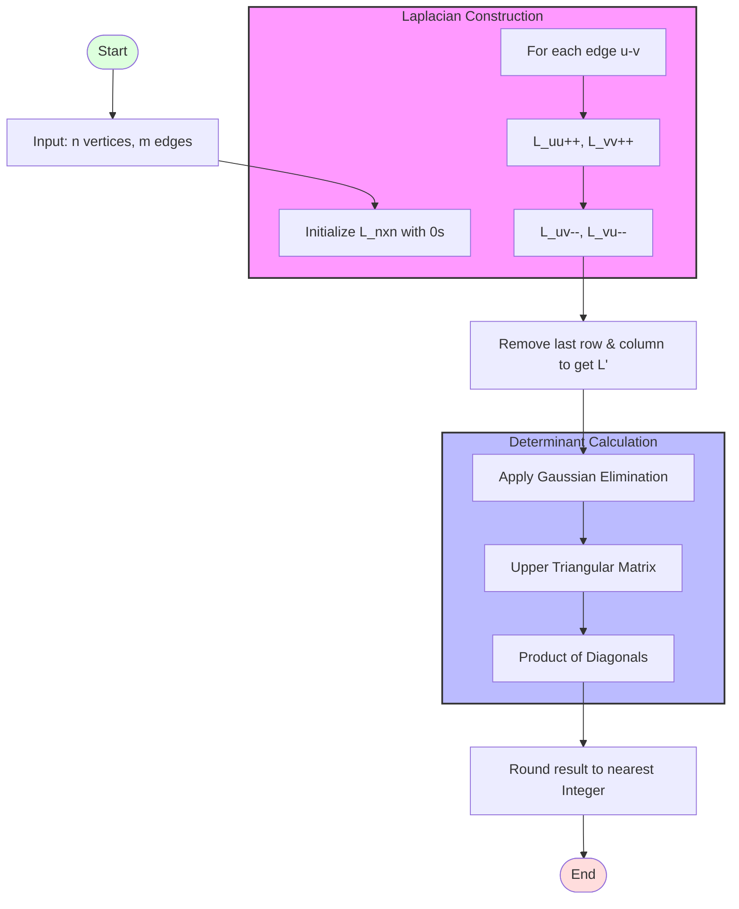

# [Total Number of Spanning Trees in a Graph](https://www.geeksforgeeks.org/problems/total-number-of-spanning-trees-in-a-graph/1)

| [Problem.md](./Problem.md) | [Approach.md](./Approach.md) | [Solution.cpp](./Solution.cpp) | [Main.cpp](./Main.cpp) | [Theorem_Logic.md](./Theorem_Logic.md) |
| :--- | :--- | :--- | :--- | :--- |

---

> [!TIP]
> **Kirchhoff's Matrix Tree Theorem** is a fundamental result in algebraic graph theory that relates the number of spanning trees of a graph to the eigenvalues and determinants of its Laplacian matrix.

## 🧠 Deep Dive: Kirchhoff's Matrix Tree Theorem

### 1. The Core Concept

A **spanning tree** of a connected graph with $n$ vertices is a subset of $n-1$ edges that forms a tree and includes every vertex. For a complete graph $K_n$, Cayley's formula tells us there are $n^{n-2}$ spanning trees. However, for an arbitrary graph, we use the Matrix Tree Theorem.

### 2. The Laplacian Matrix ($L$)

The Laplacian matrix is the key to this theorem. It is defined as:

  <h3>$L = D - A$</h3>

Where:

- **$D$ (Degree Matrix):** A diagonal matrix where $D_{ii}$ is the degree of vertex $i$.
- **$A$ (Adjacency Matrix):** A symmetric matrix where $A_{ij} = 1$ if there is an edge between $i$ and $j$, else $0$.

#### Properties of $L$

- **Row/Column Sum:** Every row and column sums to zero. This is because $L_{ii} = \sum_{j \neq i} A_{ij}$, so $L_{ii} + \sum_{j \neq i} (-A_{ij}) = 0$.
- **Singularity:** Since rows sum to zero, the matrix is singular ($\det(L) = 0$).
- **Symmetry:** For undirected graphs, $L$ is always symmetric.

### 3. The Theorem Statement

The number of spanning trees is equal to **any** cofactor of $L$. Specifically, if we delete the $i$-th row and $j$-th column of $L$ to get a matrix $L_{i,j}$, then:

  <h3>$\text{Number of Spanning Trees} = |(-1)^{i+j} \det(L_{i,j})|$</h3>

Surprisingly, the result is the same regardless of which row $i$ and column $j$ are chosen. Typically, we choose $i=j=n$ (deleting the last row and column) for simplicity.

---

## 🛠️ Logic Flow & Implementation

### Phase 1: Matrix Construction

1. Initialize an $n \times n$ matrix $L$ with zeros.
2. For each edge $(u, v)$:
    - Increment $L[u][u]$ and $L[v][v]$ (Degree part).
    - Decrement $L[u][v]$ and $L[v][u]$ (Adjacency part).

### Phase 2: Cofactor Extraction

1. Create a new matrix $L'$ of size $(n-1) \times (n-1)$.
2. Copy all elements of $L$ except for one chosen row and column (e.g., the last ones).

### Phase 3: Determinant Calculation

1. Use **Gaussian Elimination** to transform $L'$ into an upper triangular matrix.
2. The determinant is the product of the diagonal elements.
3. Handle floating-point precision by rounding the final result to the nearest integer.

---

## 📊 Visual Representation

---

## 📉 Complexity Analysis

- **Time Complexity:** $O(M + N^3)$
  - **Construction:** $O(M)$ to iterate through edges.
  - **Determinant:** $O(N^3)$ for Gaussian elimination on an $(N-1) \times (N-1)$ matrix.
- **Space Complexity:** $O(N^2)$
  - Required to store the $N \times N$ Laplacian matrix.

---

> "The properties of a graph can often be understood by looking at the properties of its matrices." — *Spectral Graph Theory*

---

Happy Coding! 🚀  

