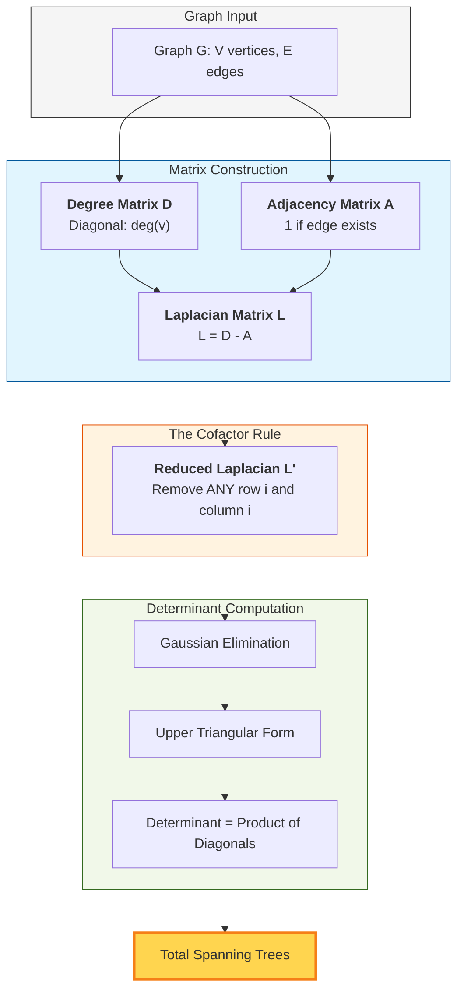

# [Kirchhoff's Matrix Tree Theorem: Logic & Visualization](https://www.geeksforgeeks.org/problems/total-number-of-spanning-trees-in-a-graph/1)

| [Problem.md](./Problem.md) | [Approach.md](./Approach.md) | [Solution.cpp](./Solution.cpp) | [Main.cpp](./Main.cpp) | [Theorem_Logic.md](./Theorem_Logic.md) |
| :--- | :--- | :--- | :--- | :--- |

---

## 🏗️ The Mathematical Foundation

Kirchhoff's Matrix Tree Theorem provides a bridge between **Graph Theory** and **Linear Algebra**. It allows us to count structural properties (spanning trees) using matrix determinants.

### 1. Matrix Definitions

To understand the theorem, we define three primary matrices:

#### A. Adjacency Matrix ($A$)
- $A_{ij} = 1$ if vertices $i$ and $j$ are connected.
- $A_{ij} = 0$ otherwise.
- It represents the "connections".

#### B. Degree Matrix ($D$)
- A diagonal matrix where $D_{ii} = \text{degree of vertex } i$.
- It represents the "capacity" of each vertex.

#### C. Laplacian Matrix ($L$)
- defined as **$L = D - A$**.
- This matrix encodes the "flow" constraints of the graph.

---

## 🔄 Visual Logic Flow

The following diagram illustrates the step-by-step transformation of a graph into a numerical result:

---

## 🔢 Step-by-Step Example

Consider a Triangle graph ($K_3$) with vertices $\{0, 1, 2\}$.

### Step 1: Laplacian Matrix
For $K_3$, each vertex has degree 2.
$$
L = \begin{pmatrix} 
2 & -1 & -1 \\
-1 & 2 & -1 \\
-1 & -1 & 2
\end{pmatrix}
$$

### Step 2: Remove Last Row & Column
$$
L' = \begin{pmatrix} 
2 & -1 \\
-1 & 2
\end{pmatrix}
$$

### Step 3: Compute Determinant
$$
\det(L') = (2 \times 2) - (-1 \times -1) = 4 - 1 = 3
$$
**Result:** 3 Spanning Trees.

---

## 🧪 Why does this work? (Intuition)

The Laplacian matrix is related to the **Incidence Matrix** $B$ of the graph ($L = BB^T$). The **Cauchy-Binet Formula** then shows that the determinant of a submatrix of $L$ is a sum of squares of determinants of submatrices of $B$. In graph theory, these submatrices of $B$ correspond exactly to the spanning trees of the graph.

---

# Happy Coding! 🚀

