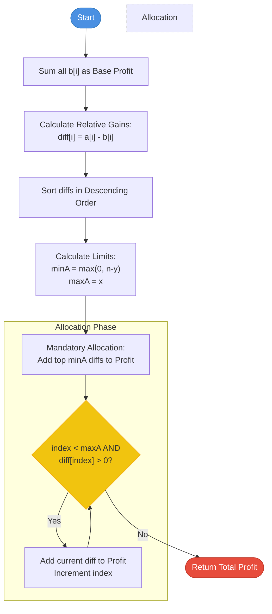

# Max Profit from Two Machines - Approach

| [Problem.md](Problem.md) | [Approach.md](Approach.md) | [Solution.cpp](Solution.cpp) | [Main.cpp](Main.cpp) |
| :--- | :--- | :--- | :--- |

---
> [!TIP]
> The key to maximizing profit is to focus on the **relative gain** (difference) between the two machines for each task, rather than just the absolute profit of a single machine.

---
## Greedy Logic Breakdown

To solve this problem efficiently, we use a **Greedy Strategy** based on the difference in profits between Machine A and Machine B.

---
### 1. The Opportunity Cost Concept
For any task $i$, we have two choices:
- Assign it to Machine A: Profit = $a[i]$
- Assign it to Machine B: Profit = $b[i]$

If we initially assume all tasks are assigned to Machine B, the total profit is $\sum b[i]$. Now, if we move a task $i$ from Machine B to Machine A, the change in profit is:
$$\text{Gain}_i = a[i] - b[i]$$

---
### 2. Constraints and Mandatory Assignments
We have two constraints:
- Machine A can take at most $x$ tasks.
- Machine B can take at most $y$ tasks.
- $x + y \geq n$ (ensures all tasks can be covered).

If $n > y$, Machine B cannot perform all tasks. Machine A **must** perform at least $minA = \max(0, n - y)$ tasks to satisfy Machine B's capacity.
Conversely, Machine A cannot perform more than $maxA = x$ tasks.

---
### 3. Step-by-Step Algorithm
1.  **Initialize**: Calculate `baseProfit` by summing all profits from Machine B ($b[i]$).
2.  **Calculate Differences**: For each task $i$, compute the relative gain $diff[i] = a[i] - b[i]$.
3.  **Sort**: Sort the $diff$ array in **descending order**.
4.  **Capacity Planning**:
    - Mandatory tasks for A: $minA = \max(0, n - y)$ (required if $n > y$).
    - Maximum tasks for A: $maxA = x$.
5.  **Allocation**:
    - Add the first $minA$ differences to `baseProfit`.
    - Iteratively add remaining differences (up to $maxA$) **only if** they are positive.

---

## Visual Representation

### Logic Flow

### Optimization Visualization

---

## Complexity Analysis

- **Time Complexity**: $O(n \log n)$
    - Calculating differences and initial sum: $O(n)$.
    - Sorting the differences: $O(n \log n)$.
    - Iterating to find the optimal assignment: $O(n)$.
- **Space Complexity**: $O(n)$
    - Storing the differences array.

---

> "Efficiency is doing things right; effectiveness is doing the right things." — Peter Drucker

---

Happy Coding! 🚀  

