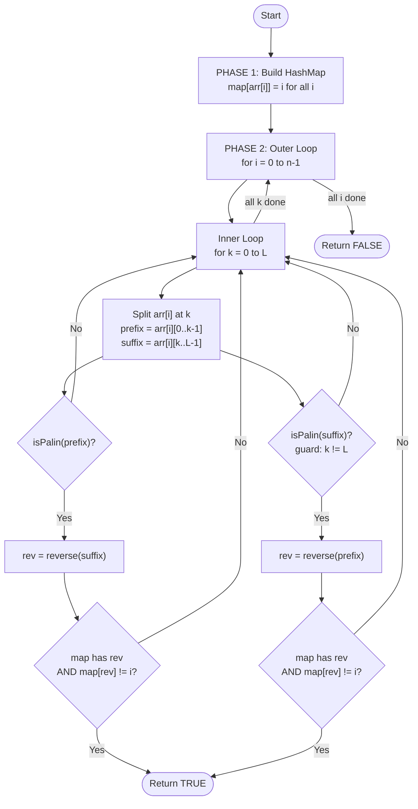
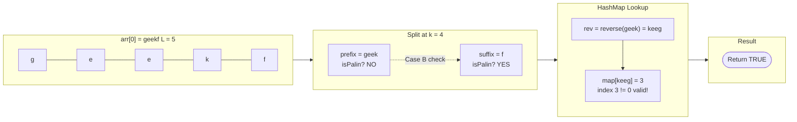
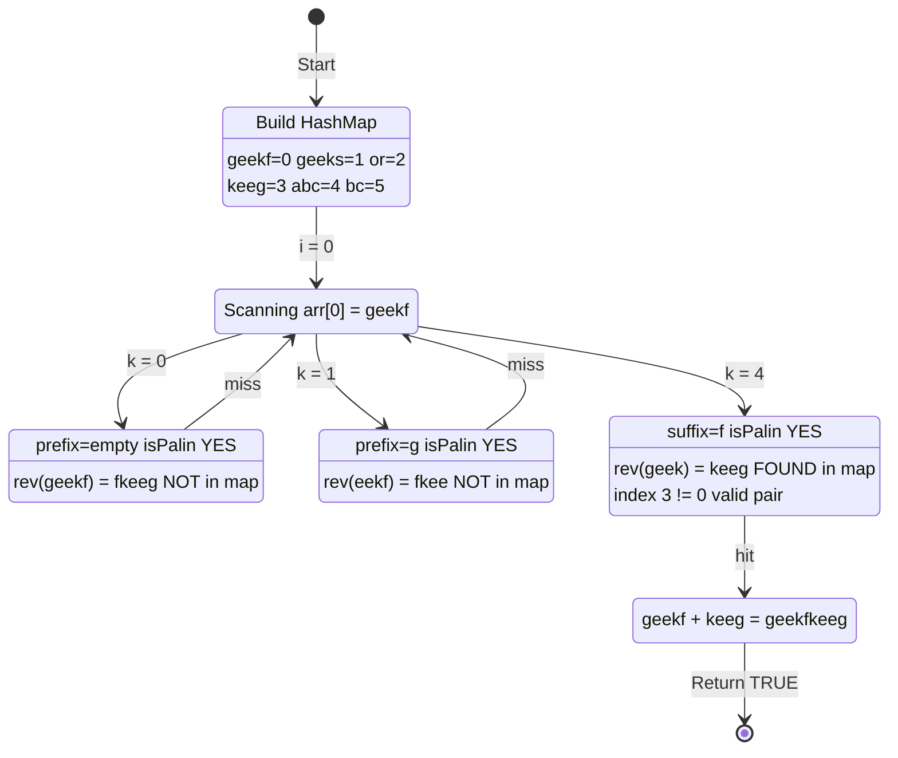

# Palindrome Pairs - Approach

| [Problem.md](Problem.md) | [Approach.md](Approach.md) | [Solution.cpp](Solution.cpp) | [Main.cpp](Main.cpp) |
| :---: | :---: | :---: | :---: |

---

> [!TIP]
> Instead of brute-forcing all O(n²) pairs, store every string in a **HashMap**. For each string, try every split point and ask: *"Does the complement that makes a palindrome exist in the map?"* This drops the complexity from O(n²·L) to O(n·L²).

---

## HashMap + Split Logic Breakdown

To solve this efficiently, we use a **HashMap lookup strategy** based on splitting each string at every possible position.

---

### 1. The Core Palindrome Observation

For `arr[i] + arr[j]` to be a palindrome, split `arr[i]` at position `k`:

$$arr[i] = \underbrace{arr[i][0..k-1]}_{\text{prefix}} + \underbrace{arr[i][k..L-1]}_{\text{suffix}}$$

Two cases arise:

- **Case A** — If `prefix` is a palindrome, we need `arr[j] = reverse(suffix)`
  Then: `arr[j] + arr[i]` forms a palindrome.

- **Case B** — If `suffix` is a palindrome, we need `arr[j] = reverse(prefix)`
  Then: `arr[i] + arr[j]` forms a palindrome.

---

### 2. Why HashMap?

Checking every pair `(i, j)` naively is O(n²·L). Instead:

- Store all strings in `map[string] = index` upfront in O(n·L).
- For each split, look up the required complement in O(L) time.
- Total: O(n·L²) — and since `L ≤ 10`, this is effectively O(n).

---

### 3. Step-by-Step Algorithm

1. **Build HashMap**: For each `arr[i]`, store `map[arr[i]] = i`.
2. **Outer loop**: Iterate every string `arr[i]`.
3. **Inner loop**: Try every split point `k` from `0` to `L`.
4. **Case A check**: If `arr[i][0..k-1]` is a palindrome → look up `reverse(suffix)` in map.
5. **Case B check**: If `arr[i][k..L-1]` is a palindrome (and `k != L`) → look up `reverse(prefix)` in map.
6. **On hit**: If lookup succeeds and index differs from `i` → return `true`.
7. **No hit**: Exhausted all strings and splits → return `false`.

---

## Visual Representation

### Logic Flow

---

### String Split Anatomy

---

### Dry Run — State Machine

---

## Complexity Analysis

- **Time Complexity**: $O(n \cdot L^2)$
    - Building HashMap: $O(n \cdot L)$
    - Outer loop × inner loop × palindrome check: $O(n \cdot L \cdot L)$
    - Since $L \leq 10$: effectively $O(n)$ in practice
- **Space Complexity**: $O(n \cdot L)$
    - HashMap stores $n$ strings of max length $L$

---

> "The most powerful tool we have as developers is automation." — Scott Hanselman

---

Happy Coding! 🚀

