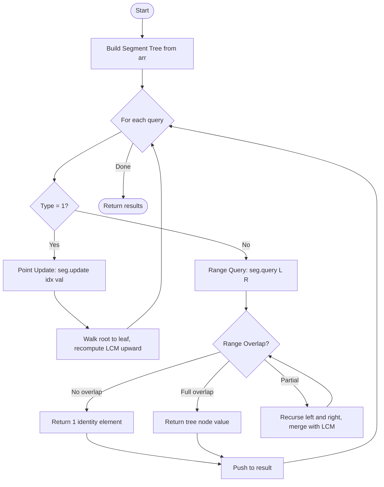

# 💡 Approach — Range LCM Queries
<div align="center">

| [Problem.md](Problem.md) | [Approach.md](Approach.md) | [Solution.cpp](Solution.cpp) | [Main.cpp](Main.cpp) |
| :---: | :---: | :---: | :---: |

</div>


---

> [!TIP]
> **Core Insight:** LCM is an *associative* operation — `LCM(a, b, c) = LCM(LCM(a, b), c)`.
> This associativity is the fundamental property that makes it compatible with a **Segment Tree**,
> which is a divide-and-conquer range-query structure that merges two sub-range results to
> compute the answer for the combined range. Every internal node stores the LCM of its range,
> enabling $O(\log n)$ both for updates and queries.

---

## 🎯 Why a Segment Tree?

| Approach                          | Query       | Update      | Space   |
|-----------------------------------|-------------|-------------|---------|
| Brute Force (iterate range)       | $O(R-L+1)$  | $O(1)$      | $O(1)$  |
| Sparse Table (static, no update)  | $O(\log n)$ | ❌           | $O(n \log n)$ |
| **Segment Tree** ✅               | $O(\log n \cdot \log V)$ | $O(\log n \cdot \log V)$ | $O(n)$ |

Given $Q \leq 10^5$ queries with both updates and range queries, the Segment Tree is the only structure that satisfies the expected complexity $O(Q \cdot \log n \cdot \log n)$.

---

## 🔩 Step-by-Step Breakdown

### Step 1 — Build the Segment Tree

Each **leaf node** stores `arr[i]`.  
Each **internal node** stores `LCM(left_child, right_child)`.

```
arr = [2, 3, 4, 6, 8, 16]

Segment Tree (node stores LCM of range):

              LCM(0..5)=48
             /            \
      LCM(0..2)=12      LCM(3..5)=48
       /      \           /       \
  LCM(0..1)=6  4   LCM(3..4)=24  16
   /    \              /    \
  2      3            6      8
```

### Step 2 — Merge Function

```cpp
long long merge(long long left, long long right) {
    return lcm(left, right);
}
// lcm(a, b) = (a / gcd(a, b)) * b
```

The identity element for LCM (returned for out-of-range nodes) is **1**, because `LCM(x, 1) = x` for any `x`.

### Step 3 — Point Update `[1, idx, val]`

1. Walk down the tree from root to the leaf at position `idx`.
2. Update the leaf: `tree[leaf] = val`.
3. On the way **back up**, recompute each ancestor:  
   `tree[node] = LCM(tree[left_child], tree[right_child])`.

### Step 4 — Range Query `[2, L, R]`

1. Start at the root.
2. If the current node's range is **completely outside** `[L, R]` → return `1` (identity).
3. If **completely inside** `[L, R]` → return `tree[node]`.
4. Otherwise → recurse into both children and merge:  
   `return LCM(query_left, query_right)`.

---

## 🔄 Mermaid Flowchart



---

## 🖼️ Premium Visualization

> *Segment tree with range LCM — each node merges two children via LCM*

```
Index:  0    1    2    3    4    5
Array:  2    3    4    6    8   16

                  [LCM=48] (0..5)
                 /                \
        [LCM=12] (0..2)     [LCM=48] (3..5)
        /           \         /           \
  [LCM=6](0..1)  [4](2)  [LCM=24](3..4)  [16](5)
    /       \              /       \
  [2](0)  [3](1)        [6](3)  [8](4)

Query [2, 0, 2]:  nodes (0..2) → LCM = 12  ✅
Query [2, 2, 5]:  LCM(node(2), node(3..5)) = LCM(4, 48) = 48 ... but
                  actual overlapping: LCM(4, 6, 8, 16)
                  = LCM(LCM(4,6), LCM(8,16)) = LCM(12, 16) = 16 ✅
```

---

## 📊 Complexity Analysis

| Phase         | Time                                 | Space   |
|---------------|--------------------------------------|---------|
| Build         | $O(n \log V)$                        | $O(n)$  |
| Point Update  | $O(\log n \cdot \log V)$             | $O(1)$  |
| Range Query   | $O(\log n \cdot \log V)$             | $O(1)$  |
| **Total (Q queries)** | $O((n + Q) \cdot \log n \cdot \log V)$ | $O(n)$ |

Where $V = \max(\text{arr}[i]) \leq 10^4$, so $\log V \approx 14$. This fits comfortably within all constraints.

---

## ⚙️ Key Implementation Notes

1. **1-indexed tree array** — node `i`'s children are at `2i` and `2i+1`; allocate `4n` nodes.
2. **Identity element is 1** — `LCM(x, 1) = x`, safe to return from out-of-range nodes.
3. **Divide before multiply in LCM** — `(a / gcd(a, b)) * b` avoids intermediate overflow for `a, b ≤ 10^4`.
4. **Long long** — the LCM can grow large across a range; always use `long long` in the tree.

---

> *"The art of doing mathematics consists in finding that special case which contains all the germs of generality."*
> — **David Hilbert**

---
<div align="center">
Happy Coding! 🚀 <br>
<a href="https://x.com/PankajB42550" target="_blank">
  
</a>
</div>
