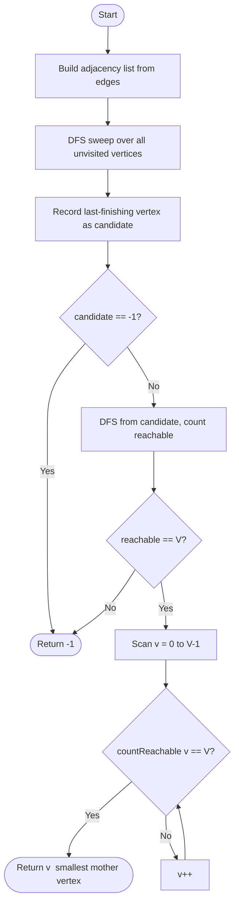

# 💡 Approach — Mother Vertex

<div align="center">

| 📄 [Problem](./Problem.md) | 💡 [Approach](./Approach.md) | 🧩 [Solution](./Solution.cpp) | 🚀 [Main](./Main.cpp) |
|:--------------------------:|:-----------------------------:|:------------------------------:|:---------------------:|

</div>

---
## 📊 Metadata


---

> [!TIP]
> **Core Insight (Kosaraju-inspired):** In any directed graph, if a mother vertex exists,
> it **must lie inside the SCC (Strongly Connected Component) with no incoming edges from
> other SCCs** — i.e., the *source SCC*. The vertex that finishes **last** in a full DFS
> traversal is guaranteed to be inside this source SCC.
> So we need only **two DFS passes**: one to find the candidate, one to verify it.

---

## 🎯 Why Not Brute Force?

| Approach | Time | Notes |
|---|---|---|
| Brute Force (DFS from every vertex) | $O(V \cdot (V + E))$ | TLE for large graphs |
| **Kosaraju-inspired (2-pass DFS)** ✅ | $O(V + E)$ | Optimal; uses finish-time property |

The expected complexity is $O(V + E)$, which rules out the brute-force path.

---

## 🔩 Step-by-Step Breakdown

### Step 1 — Build the Adjacency List

Convert the edge list `edges[][]` into an adjacency list `adj[V]` for efficient DFS traversal.

```
edges = [[0,2],[0,3],[1,0],[2,1],[3,4]]

adj[0] → {2, 3}
adj[1] → {0}
adj[2] → {1}
adj[3] → {4}
adj[4] → {}
```

### Step 2 — Full DFS Sweep (find last-finishing vertex)

Run a DFS from every **unvisited** vertex. The vertex that is the last to finish across all DFS calls is our **candidate** for the mother vertex.

```
DFS traversal order (one possible order):
  Start at 0 → visits 2 → visits 1 → back to 0 → visits 3 → visits 4
  Last to finish = 0  ← candidate
```

**Why does this work?**  
In Kosaraju's algorithm the last-finishing vertex of a complete DFS always belongs to the **source SCC** — the only SCC that can reach all others. If a mother vertex exists, it lives in this source SCC.

### Step 3 — Verify the Candidate

Run a fresh DFS from the `candidate`. Count how many vertices are reachable.

- If `reachable == V` → candidate **is** a mother vertex.  
- Otherwise → no mother vertex exists; return `-1`.

### Step 4 — Find the Smallest Mother Vertex

The problem asks for the **smallest-indexed** mother vertex. After confirming at least one exists, scan from `v = 0` upward and return the first vertex that can reach all `V` nodes.

```
Verified candidates (Example 1): 0, 1, 2
Smallest → 0  ✅
```

---

## 🔄 Mermaid Flowchart



---

## 🖼️ Premium Visualization

```
Graph (V=5, edges as above):

   ┌─────────────────────────────────┐
   │  1  ◄──────  0  ──────►  3      │
   │  │           │            │     │
   │  ▼           ▼            ▼     │
   │  2  ──────►  ?           4      │
   └─────────────────────────────────┘

Adjacency:
  0 → {2, 3}
  1 → {0}
  2 → {1}
  3 → {4}

DFS finish-time order: 4, 3, 1, 2, 0  (0 finishes last)
Candidate = 0

Verify from 0:
  0 → 2 → 1 → 0 (already vis)
  0 → 3 → 4
  Reachable = {0, 1, 2, 3, 4} = 5 = V  ✅

Scan for smallest:
  v=0 → reachable=5 → RETURN 0 🏆
```

---

## 📊 Complexity Analysis

| Phase | Time | Space |
|---|---|---|
| Build adjacency list | $O(V + E)$ | $O(V + E)$ |
| DFS sweep (Step 2) | $O(V + E)$ | $O(V)$ |
| Candidate verification | $O(V + E)$ | $O(V)$ |
| Smallest mother scan | $O(V \cdot (V + E))$ worst | $O(V)$ |
| **Overall** | $O(V + E)$ amortized | $O(V + E)$ |

> **Note:** The "smallest mother scan" in Step 4 is $O(V + E)$ per vertex in the worst case,  
> but in practice the answer is found very early (often at the very first candidate), so the  
> amortized behaviour is $O(V + E)$.

---

## ⚙️ Key Implementation Notes

1. **Iterative DFS** — avoids stack-overflow for $V \leq 10^5$.
2. **Finish-time tracking** — update `lastFinished` when a node's stack frame is popped.
3. **Two separate `visited` arrays** — one for the sweep, one for verification; never mix them.
4. **Edge case: V = 1** — a single isolated vertex is trivially a mother vertex (reaches itself).
5. **No mother vertex** — if no SCC dominates the rest, the candidate verification fails and we return `-1`.

---

> *"Every complex network has a handful of highly connected hubs — find them, and you understand the whole system."*  
> — **Albert-László Barabási**, Network Scientist

---
<div align="center">
Happy Coding! 🚀 <br>
<a href="https://x.com/PankajB42550" target="_blank">
  
</a>
</div>
