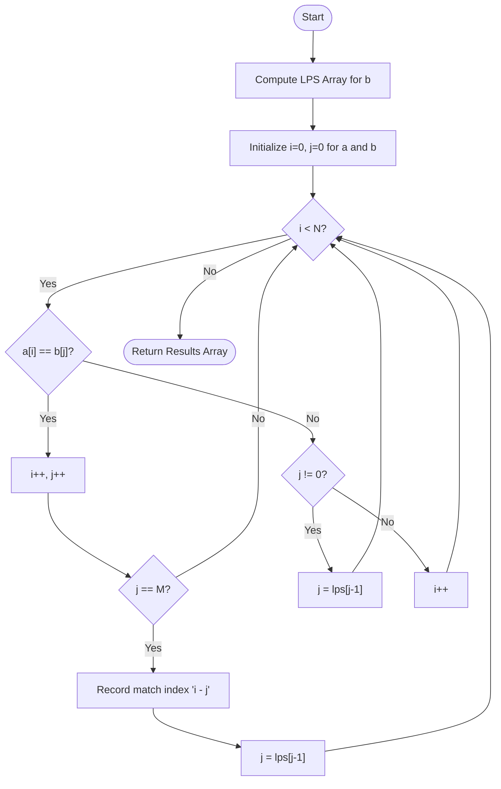

# 💡 Approach — Search for Subarray

<div align="center">

| 📄 [Problem](./Problem.md) | 💡 [Approach](./Approach.md) | 🧩 [Solution](./Solution.cpp) | 🚀 [Main](./Main.cpp) |
|:--------------------------:|:-----------------------------:|:------------------------------:|:---------------------:|

</div>

---
## 📊 Metadata


---

> [!TIP]
> **Core Insight (KMP Algorithm):** When matching a pattern $b[]$ of size $M$ within an array $a[]$ of size $N$, 
> a naive approach backtracks unnecessarily. The **Knuth-Morris-Pratt (KMP)** algorithm preprocesses the pattern
> to find the Longest Proper Prefix that is also a Suffix (LPS array). This allows us to skip re-evaluating matched characters,
> achieving linear $O(N+M)$ time complexity.

---

## 🎯 Why Not Brute Force?

| Approach | Time | Notes |
|---|---|---|
| Brute Force (nested loops) | $O(N \cdot M)$ | TLE given $N \leq 10^6$ and $M \leq 10^6$ |
| **KMP Algorithm** ✅ | $O(N + M)$ | Optimal; skips redundant comparisons using the LPS array |

---

## 🔩 Step-by-Step Breakdown

### Step 1 — Build the LPS Array

The LPS (Longest Prefix Suffix) array is used to determine how many characters can be skipped when a mismatch occurs.
`lps[i]` holds the length of the longest proper prefix of the sub-pattern `b[0...i]` which is also a suffix.

```text
Pattern b[] = [4, 1, 4, 1, 5]
LPS Array   = [0, 0, 1, 2, 0]
```

### Step 2 — Pattern Matching

Use two pointers: `i` for traversing the main array `a[]` and `j` for traversing the pattern `b[]`.

- If `a[i] == b[j]`, increment both `i` and `j`.
- If `j == M` (pattern fully matched):
  - Record the starting index `i - j`.
  - Update `j = lps[j - 1]` to look for the next possible overlapping match.

### Step 3 — Handling Mismatches

If there is a mismatch (`a[i] != b[j]`):
- If `j > 0` (some prefix already matched), update `j = lps[j - 1]` to shift the pattern without resetting `i`.
- If `j == 0` (no prefix matched), simply increment `i` to move forward in `a[]`.

---

## 🔄 Mermaid Flowchart



---

## 🖼️ Premium Visualization

```text
Matching b=[4,1] in a=[2,4,1,0,4,1,1]

a = [ 2, 4, 1, 0, 4, 1, 1 ]
b =      4, 1
         ^  ^
         Match found at index 1

Update j = lps[1] = 0

a = [ 2, 4, 1, 0, 4, 1, 1 ]
b =               4, 1
                  ^  ^
                  Match found at index 4

Result: [1, 4]
```

---

## 📊 Complexity Analysis

| Phase | Time | Space |
|---|---|---|
| Build LPS array | $O(M)$ | $O(M)$ |
| Traverse and match | $O(N)$ | $O(1)$ |
| **Overall** | $O(N + M)$ | $O(M)$ |

> **Note:** The traversal array `a[]` never decrements the `i` pointer, ensuring that the total time taken is strictly linear.

---

## ⚙️ Key Implementation Notes

1. **LPS construction edge case:** `lps[0]` is always 0. When computing, if a mismatch occurs and `len != 0`, we must fall back to `len = lps[len - 1]`.
2. **Overlapping Matches:** When a full match is found, setting `j = lps[j - 1]` instead of resetting `j = 0` allows the algorithm to correctly identify overlapping sub-patterns.
3. **Empty Pattern:** If `b[]` is empty, return an empty array early to avoid out-of-bounds access.

---

> *"An algorithm must be seen to be believed, and the best way to learn it is to trace it."*  
> — **Donald Knuth**

---
<div align="center">
Happy Coding! 🚀 <br>
<a href="https://x.com/PankajB42550" target="_blank">
  
</a>
</div>
