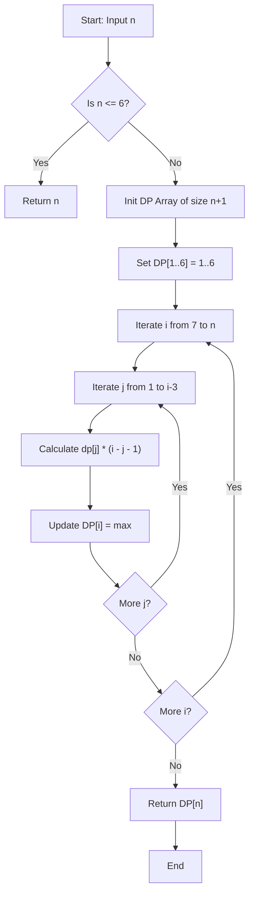

# 💡 Approach — Special Keyboard

| 📄 [Problem](./Problem.md) | 💡 [Approach](./Approach.md) | 🧩 [Solution](./Solution.cpp) | 🚀 [Main](./Main.cpp) |
|:--------------------------:|:-----------------------------:|:------------------------------:|:---------------------:|

## 📊 Metadata

> [!TIP]
> **Core Insight:**
> For $n \le 6$, the maximum number of 'A's is simply $n$ (pressing Key 1 repeatedly). For $n > 6$, the optimal sequence will always end with a series of pastes (Key 4) preceded by a "Select All" (Key 2) and "Copy" (Key 3). Thus, if we perform the Ctrl+A and Ctrl+C operations at step $j$, the multiplier for the copied length will be $(i - j - 1)$ for the remaining steps up to $i$. We can dynamically calculate the max 'A's by finding the best break point $j$.

---
## 🔩 Step-by-Step Breakdown

1.  **Handle Base Cases:** If $n \le 6$, the optimal strategy is to just press Key 1 $n$ times. Thus, we can directly return $n$.
2.  **Initialize DP Array:** Create an array `dp` of size `n + 1` to store the maximum characters achievable for each key press count. For indices $1$ to $6$, set `dp[i] = i`.
3.  **Iterate for Larger $n$:** Start computing values from $i = 7$ up to $n$.
4.  **Find Optimal Break Point:** For each $i$, determine the optimal step $j$ (where $1 \le j \le i-3$) to perform the Select and Copy operations. The number of characters becomes `dp[j] * (i - j - 1)`. Update `dp[i]` with the maximum value found.
5.  **Return Result:** After filling the `dp` array, the answer for $n$ key presses is stored in `dp[n]`.

---

## 🔄 Mermaid Flowchart

---
## 📊 Complexity Analysis

| Parameter | Complexity | Description |
|-----------|------------|-------------|
| **Time Complexity** | $\mathcal{O}(N^2)$ | We use two nested loops. The outer loop runs $N$ times and the inner loop runs up to $N-3$ times. Given the constraint ($N \le 70$), this is equivalent to $\mathcal{O}(N)$ in practical execution time and easily passes. |
| **Space Complexity** | $\mathcal{O}(N)$ | The algorithm requires an array of size $N+1$ to store the dynamic programming states. |

---

> *"First, solve the problem. Then, write the code."* — John Johnson

---

<h2>Happy Coding! 🚀</h2>

