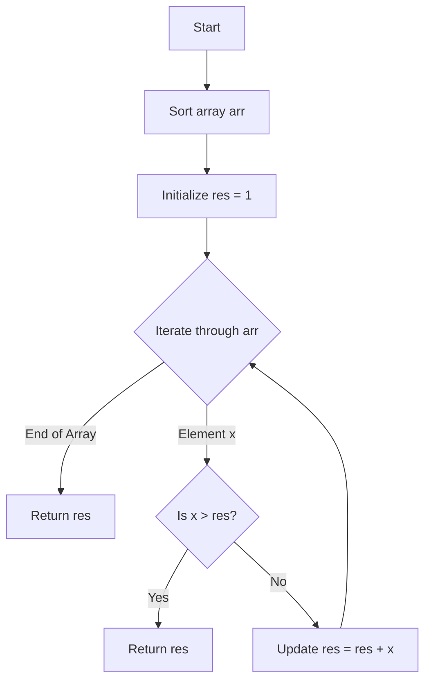

# 💡 Approach — Not a subset sum

| 📄 [Problem](./Problem.md) | 💡 [Approach](./Approach.md) | 🧩 [Solution](./Solution.cpp) | 🚀 [Main](./Main.cpp) |
|:--------------------------:|:-----------------------------:|:------------------------------:|:---------------------:|

---

## 📊 Metadata

---
> [!TIP]
> **Core Insight:** If we can form all sums from $1$ to $X$, and we encounter a new element $Y$, we can now form all sums up to $X + Y$ **if and only if** $Y \le X + 1$. If $Y > X + 1$, then $X + 1$ is the smallest number we cannot represent.

---

## 🔩 Step-by-Step Breakdown
1. **Sort the Array:** Arrange the elements in non-decreasing order to process the smallest possible sums first.
2. **Initialize Tracking Variable:** Let `res = 1` be the smallest positive integer we are currently trying to represent.
3. **Iterate and Expand:** Loop through the sorted array.
   - If the current element `arr[i]` is greater than `res`, we have found a gap. Return `res`.
   - Otherwise, `arr[i] \le res`, so we can now form all sums up to `res + arr[i] - 1`. Update `res = res + arr[i]`.
4. **Final Result:** If the loop finishes, `res` is the smallest value we couldn't represent.

---

## 🔄 Mermaid Flowchart

---

## 📊 Complexity Analysis
| Type | Complexity | Description |
| :--- | :--- | :--- |
| **Time Complexity** | $$O(n \log n)$$ | Dominated by the sorting step. The iteration takes $$O(n)$$. |
| **Auxiliary Space** | $$O(1)$$ | No extra space used besides the input array (depending on sorting implementation). |

---

> *"The goal of competitive programming is not just to find the answer, but to find the most efficient path to it."*

---

  <h3>Happy Coding! 🚀</h3>

