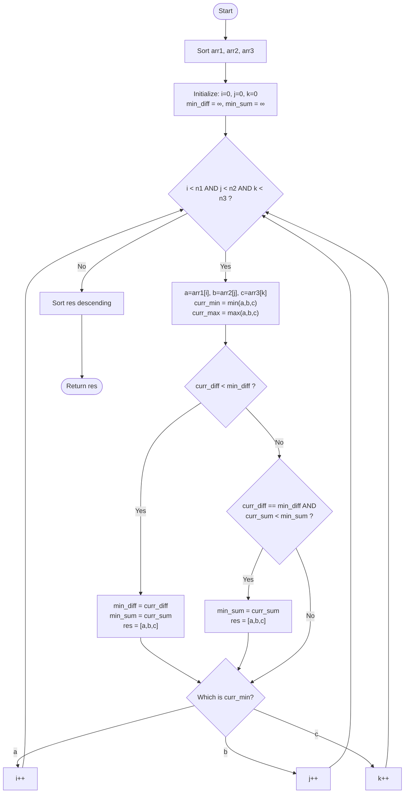

# Approach: Three Pointers on Sorted Arrays

  <a href="./Problem.md"><strong>Problem Statement</strong></a> |
  <a href="./Solution.cpp"><strong>Solution.cpp</strong></a> |
  <a href="./Main.cpp"><strong>Main.cpp</strong></a>

 

## 💡 Intuition

The problem asks us to find a triplet `(a, b, c)` from three arrays such that the difference between the maximum and minimum elements in the triplet is minimized. If there's a tie, we should prefer the triplet with the smallest sum.

A brute-force approach would check all combinations, running in $\mathcal{O}(N^3)$ time, which is too slow. 

To optimize this, we can **sort all three arrays**. 
Once the arrays are sorted, we can use three pointers (`i`, `j`, `k`), each initially pointing to the start of one of the arrays. 

At any step:
1. The current triplet is `(arr1[i], arr2[j], arr3[k])`.
2. We find the minimum and maximum of these three values.
3. The difference is `curr_max - curr_min`.
4. To try and find a smaller difference in subsequent steps, we must **increment the pointer that points to the minimum value**. Why? Because increasing the minimum value is the only way we could potentially reduce the gap `(curr_max - curr_min)`. Moving the pointer for the maximum value would only increase the maximum, thus increasing the difference. Moving the middle value wouldn't decrease the range either.

## 🛠️ Algorithm

1. Sort `arr1`, `arr2`, and `arr3` in ascending order.
2. Initialize pointers `i = 0`, `j = 0`, `k = 0`.
3. Initialize `min_diff` to infinity and `min_sum` to infinity.
4. Iterate while all three pointers are within their respective array bounds (`i < n1`, `j < n2`, `k < n3`):
   - Get the current elements `a = arr1[i]`, `b = arr2[j]`, `c = arr3[k]`.
   - Calculate `curr_min = min(a, b, c)` and `curr_max = max(a, b, c)`.
   - Calculate `curr_diff = curr_max - curr_min` and `curr_sum = a + b + c`.
   - If `curr_diff < min_diff`, update `min_diff`, `min_sum`, and the result triplet.
   - If `curr_diff == min_diff` and `curr_sum < min_sum`, update `min_sum` and the result triplet.
   - Increment the pointer that currently points to the `curr_min`.
5. Sort the final result triplet in descending order as required by the problem statement.
6. Return the triplet.

## 📊 Visual Representation

## ⏳ Complexity Analysis

- **Time Complexity:** $\mathcal{O}(N \log N)$ where $N$ is the size of the arrays. Sorting the three arrays takes $\mathcal{O}(N \log N)$. The while loop takes at most $\mathcal{O}(3N) = \mathcal{O}(N)$ since at each step one pointer is incremented. Overall time complexity is dominated by sorting.
- **Space Complexity:** $\mathcal{O}(1)$ or $\mathcal{O}(\log N)$ auxiliary space depending on the sorting algorithm used by the language standard library. We only use constant extra space for variables.

## 🚶‍♂️ Example Walkthrough

**Input:**
`a = [5, 2, 8]`
`b = [10, 7, 12]`
`c = [9, 14, 6]`

**Sorted:**
`a = [2, 5, 8]`
`b = [7, 10, 12]`
`c = [6, 9, 14]`

| i, j, k | Triplet (a, b, c) | min | max | diff | sum | Updated Result | Pointer moved |
| :---: | :---: | :---: | :---: | :---: | :---: | :---: | :---: |
| 0, 0, 0 | `(2, 7, 6)` | 2 | 7 | 5 | 15 | `[7, 6, 2]` | `i++` (a=2) |
| 1, 0, 0 | `(5, 7, 6)` | 5 | 7 | 2 | 18 | `[7, 6, 5]` | `i++` (a=5) |
| 2, 0, 0 | `(8, 7, 6)` | 6 | 8 | 2 | 21 | No (sum `21 > 18`) | `k++` (c=6) |
| 2, 0, 1 | `(8, 7, 9)` | 7 | 9 | 2 | 24 | No (sum `24 > 18`) | `j++` (b=7) |
| ... | ... | ... | ... | ... | ... | ... | ... |

*(Algorithm continues to search for smaller differences but `2` remains the minimum).*

**Final Output:** `[7, 6, 5]`
