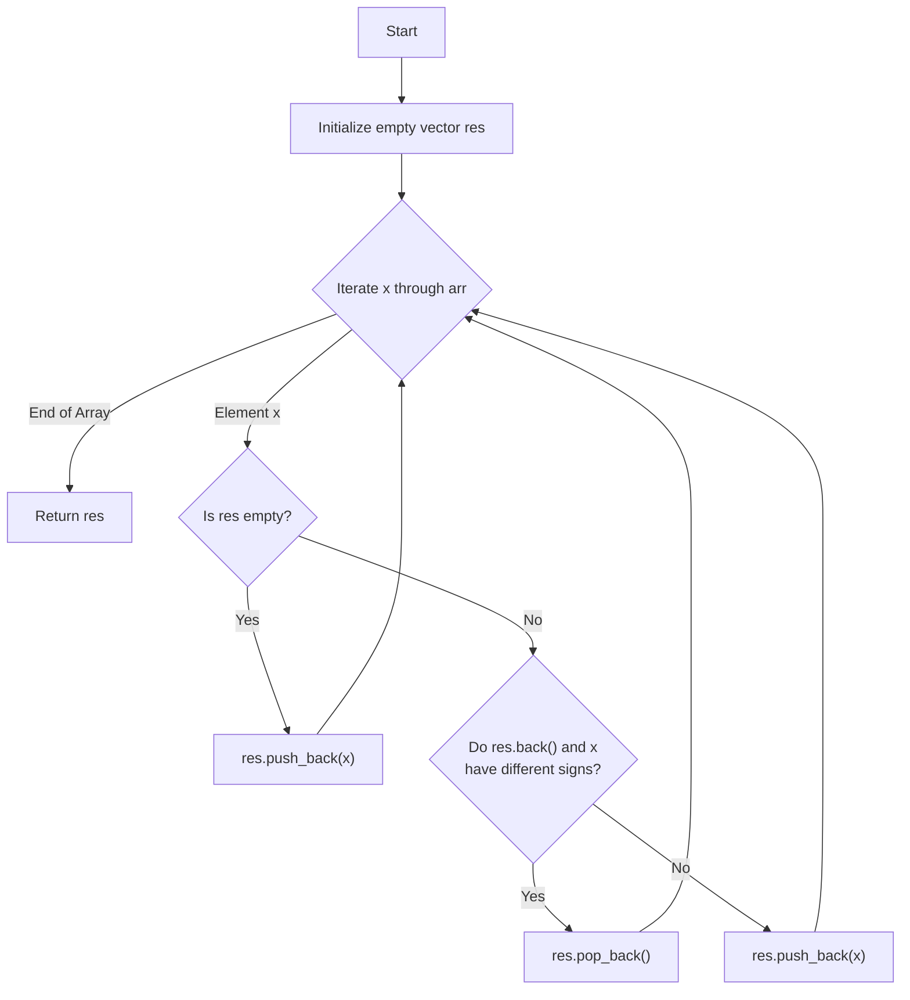

# 💡 Approach — Make the array beautiful

| 📄 [Problem](./Problem.md) | 💡 [Approach](./Approach.md) | 🧩 [Solution](./Solution.cpp) | 🚀 [Main](./Main.cpp) |
|:--------------------------:|:-----------------------------:|:------------------------------:|:---------------------:|

---

## 📊 Metadata

---
> [!TIP]
> **Core Insight:** The operation of removing adjacent elements with opposite signs is analogous to matching parentheses. A **Stack** data structure is perfect here: it allows us to compare each incoming element with the most recently kept element (the top of the stack) in $$O(1)$$ time. By using a C++ `std::vector` as a stack, we can build the result in-place and avoid reversing the output at the end!

---

## 🔩 Step-by-Step Breakdown
1. **Initialize an Empty Result Vector (Stack):** Create an empty vector `res` to simulate a stack. This stores the elements that are part of the current beautiful array.
2. **Iterate Through the Input Array:** Loop through each element `x` in `arr` from left to right to ensure the correct scanning order.
3. **Compare Signs with the Stack Top:**
   - If the stack is not empty, look at the top element (`res.back()`).
   - Check if `res.back()` and `x` have opposite signs:
     - One is non-negative ($$\ge 0$$) and the other is negative ($$< 0$$).
   - If they have **different signs**, pop the top element from the stack (`res.pop_back()`), effectively eliminating both elements.
   - If they have the **same sign**, or if the stack is empty, push `x` onto the stack (`res.push_back(x)`).
4. **Return the Result:** Once all elements have been processed, return `res`.

---

## 🔄 Mermaid Flowchart

---

## 📊 Complexity Analysis
| Type | Complexity | Description |
| :--- | :--- | :--- |
| **Time Complexity** | $$O(n)$$ | We perform a single pass over the array of size $$n$$. Each element is pushed and popped from the stack at most once, taking $$O(1)$$ time per operation. |
| **Auxiliary Space** | $$O(n)$$ | In the worst-case scenario (e.g., all elements have the same sign), no elements are removed, and the stack stores all $$n$$ elements. |

---

> *"Elegant code is not that which has no more to add, but that which has no more to remove."*

---

  <h3>Happy Coding! 🚀</h3>

