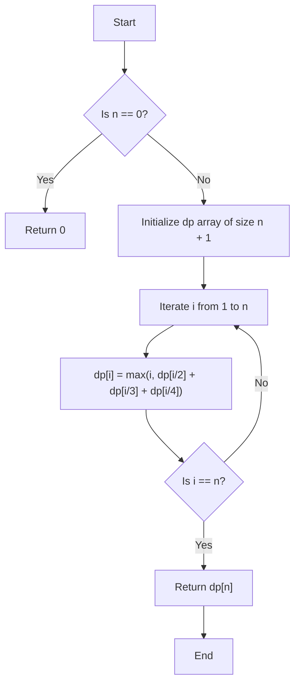

# 💡 Approach — Maximum Sum Problem

| 📄 [Problem](./Problem.md) | 💡 [Approach](./Approach.md) | 🧩 [Solution](./Solution.cpp) | 🚀 [Main](./Main.cpp) |
|:--------------------------:|:-----------------------------:|:------------------------------:|:---------------------:|

---

## 📊 Metadata

---
> [!TIP]
> **Core Insight:** The problem requires us to find the maximum sum of $n$ after recursively splitting it into $\lfloor n/2 \rfloor$, $\lfloor n/3 \rfloor$, and $\lfloor n/4 \rfloor$. At each step, we can either keep $n$ as it is or split it. This exhibits **Optimal Substructure** and **Overlapping Subproblems**, defined by the recurrence relation:
> $$f(n) = \max(n, f(\lfloor n/2 \rfloor) + f(\lfloor n/3 \rfloor) + f(\lfloor n/4 \rfloor))$$
> Since $n \le 10^6$, we can compute these values bottom-up using a Dynamic Programming table (array) in linear time $O(n)$ without any recursion stack overhead!

---

## 🔩 Step-by-Step Breakdown
1. **Handle Base Cases:** If $n = 0$, the maximum sum is simply $0$.
2. **Initialize DP Table:** Create a vector `dp` of size $n + 1$ initialized with $0$ to store the maximum sum for each value from $0$ to $n$.
3. **Bottom-Up DP Computation:** Loop through all integers $i$ from $1$ to $n$. For each $i$, compute `dp[i]` as the maximum of:
   - The number itself: $i$
   - The sum of its recursive splits: `dp[i / 2] + dp[i / 3] + dp[i / 4]`
4. **Return Results:** Return the precalculated result for $n$, which is `dp[n]`.

---

## 🔄 Mermaid Flowchart

---

## 📊 Complexity Analysis
| Type | Complexity | Description |
| :--- | :--- | :--- |
| **Time Complexity** | $$O(n)$$ | We compute the maximum sum for each integer from $1$ to $n$ exactly once. Each transition takes $$O(1)$$ time. |
| **Auxiliary Space** | $$O(n)$$ | We use a DP array of size $$n + 1$$ to store the computed results. For the maximum constraint $n = 10^6$, this is only ~4 MB. |

---

> *"Recursion is the root of computation, but memoization is the fruit of efficiency."*

---

<h2>Happy Coding! 🚀</h2>

