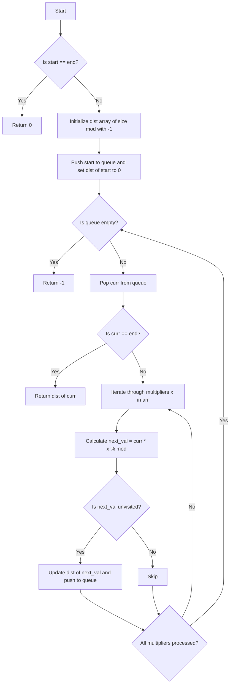

# 💡 Approach — Minimum Multiplications to reach End

| 📄 [Problem](./Problem.md) | 💡 [Approach](./Approach.md) | 🧩 [Solution](./Solution.cpp) | 🚀 [Main](./Main.cpp) |
|:--------------------------:|:-----------------------------:|:------------------------------:|:---------------------:|

---

## 📊 Metadata

---
> [!TIP]
> **Core Insight:** The problem requires finding the minimum number of multiplication operations to transform `start` to `end` modulo $M$. Since each multiplication counts as exactly $1$ operation, we can model this as finding the **shortest path in an unweighted directed graph**:
> - **Nodes:** The states (integers from $0$ to $M - 1$).
> - **Edges:** Directed edge from state $u$ to state $v$ where $v = (u \times \text{arr}[i]) \pmod{M}$ for any element in `arr[]`.
>
> In an unweighted graph, **Breadth-First Search (BFS)** is optimal because it explores states layer by layer (by distance), guaranteeing that the first time we pop `end` from the queue, we have reached it in the minimum number of steps.

---

## 🔩 Step-by-Step Breakdown
1. **Handle Edge Case:** If `start == end`, the target is already reached. Return `0` immediately.
2. **Initialize Distance Array & Queue:** Create a distance vector `dist` of size `mod` initialized to `-1` to keep track of the minimum operations to reach each state and avoid visiting nodes multiple times. Initialize a queue `q` for BFS, push `start` to it, and set `dist[start] = 0`.
3. **BFS Traversal:** While the queue is not empty, pop the front state `curr`. If `curr == end`, return its distance `dist[curr]`.
4. **State Transition:** For each multiplier `x` in the array `arr[]`, calculate the next state: `next_val = (1LL * curr * x) % mod`. (Using `1LL` avoids potential 32-bit integer overflow).
5. **Visit & Enqueue:** If `dist[next_val] == -1` (meaning `next_val` is unvisited), set its distance `dist[next_val] = dist[curr] + 1` and push it to the queue.
6. **Return Unreachable:** If the BFS traversal finishes and the queue becomes empty without ever finding `end`, it means `end` is unreachable. Return `-1`.

---

## 🔄 Mermaid Flowchart

---

## 📊 Complexity Analysis
| Type | Complexity | Description |
| :--- | :--- | :--- |
| **Time Complexity** | $$O(N \times M)$$ | In the worst case, we visit each of the $$M$$ states once. For each popped state, we iterate through all $$N$$ elements in the input array `arr[]`. Therefore, the time complexity is bounded by $$O(N \times M)$$. |
| **Auxiliary Space** | $$O(M)$$ | We use a distance vector `dist` of size $$M$$ and a BFS queue which can store at most $$M$$ states. |

---

> *"The shortest path is not always a straight line; sometimes it requires a series of modular leaps."*

---

<h2>Happy Coding! 🚀</h2>

