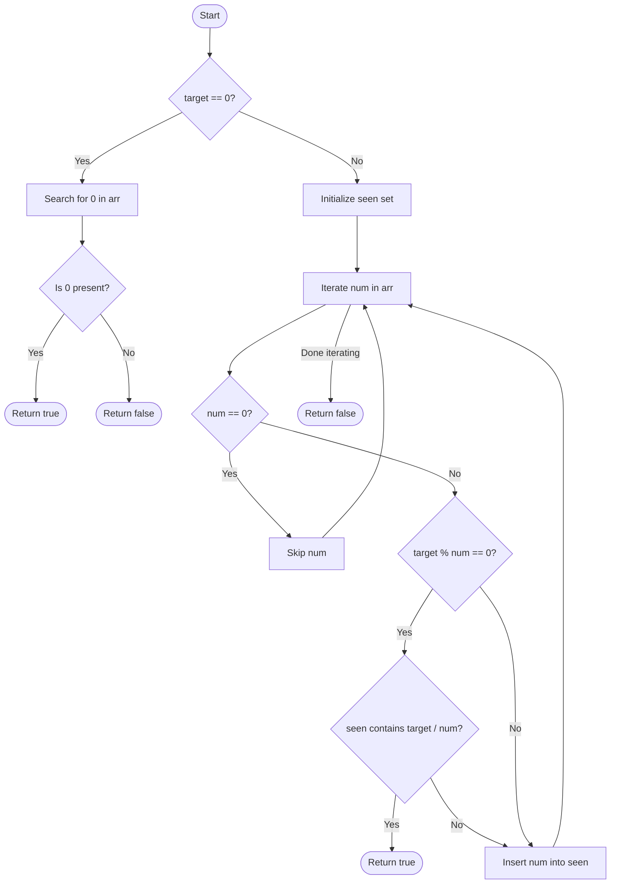

# 💡 Approach — Product Pair

| 📄 [Problem](./Problem.md) | 💡 [Approach](./Approach.md) | 🧩 [Solution](./Solution.cpp) | 🚀 [Main](./Main.cpp) |
| :------------------------: | :--------------------------: | :---------------------------: | :-------------------: |

# 📊 Metadata

---

> [!TIP]
> **Core Insight:**  
> To find two numbers $a$ and $b$ such that $a \times b = \text{target}$ in $\mathcal{O}(N)$ time:
>
> 1. If $\text{target} = 0$, we only need to verify if the array contains at least one $0$. Since the array size is $\ge 2$, any $0$ can pair with another element to yield a product of $0$.
> 2. If $\text{target} \ne 0$, we can iterate through the array and use a hash set to keep track of elements we've already visited. For each non-zero element $x$, we check if $\text{target}$ is divisible by $x$. If it is, and the complement $\text{target} / x$ has already been seen, we've found our pair!

---

## 🔩 Step-by-Step Breakdown

### Step 1: Special Case for Target = 0

- If the `target` is `0`, iterate through `arr` to check if `0` is present.
- Since $\text{arr.size()} \ge 2$, any $0$ present can be paired with any other element at a different index to produce a product of $0$.
- If `0` is found, return `true`, else return `false`.

### Step 2: Hashing Setup for Target ≠ 0

- Initialize an `unordered_set<long long> seen` to store previously visited elements.

### Step 3: Iterate and Match

- For each element `num` in the array `arr`:
  - If `num == 0`, skip it (since $0 \times y = 0 \ne \text{target}$).
  - Check if `target % num == 0`.
  - If yes, calculate `complement = target / num`.
  - Check if `seen` contains `complement`. If it does, return `true`.
  - Insert `num` into `seen` to make it available for future comparisons.

### Step 4: Fallback

- If the loop terminates without finding any matching pair, return `false`.

---

## 🔄 Mermaid Flowchart

---

## 📊 Complexity Analysis

| Type                 | Complexity       | Rationale                                                                                                     |
| :------------------- | :--------------- | :------------------------------------------------------------------------------------------------------------ |
| **Time Complexity**  | $\mathcal{O}(N)$ | We perform a single pass through the array. Hash set insertions and lookups take $\mathcal{O}(1)$ on average. |
| **Space Complexity** | $\mathcal{O}(N)$ | In the worst case, we store up to $N$ unique elements in the hash set.                                        |

---

> _"The only way to learn a new programming language is by writing programs in it."_ — Dennis Ritchie

---

<h2>Happy Coding! 🚀</h2>

