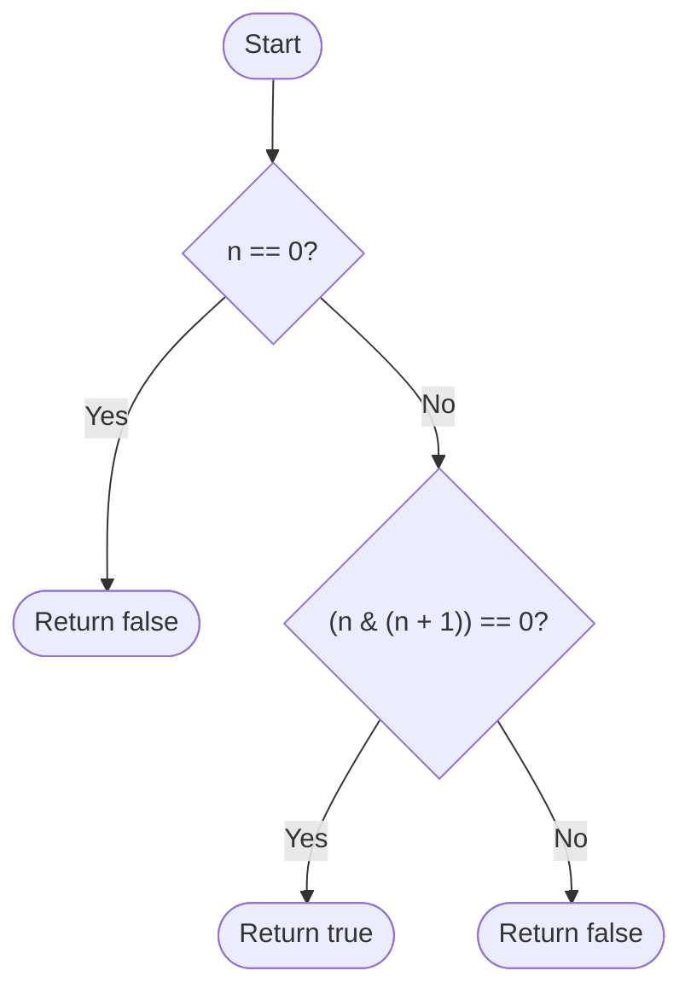

# 💡 Approach — Check if All Bits Set

| 📄 [Problem](./Problem.md) | 💡 [Approach](./Approach.md) | 🧩 [Solution](./Solution.cpp) | 🚀 [Main](./Main.cpp) |
| :------------------------: | :--------------------------: | :---------------------------: | :-------------------: |

# 📊 Metadata

---

> [!TIP]
> **Core Insight:**  
> A binary number has all its bits set (i.e., of the form $111\dots1_2$) if and only if it is equal to $2^k - 1$ for some integer $k \ge 1$.
> 
> 1. If we add $1$ to such a number, it rolls over to $2^k$ (a single set bit followed by $k$ zeros, e.g., $7 + 1 = 8 \implies 0111_2 + 1 = 1000_2$).
> 2. Performing a bitwise AND between $n$ and $n + 1$ yields $0$ if all bits are set (e.g., $7 \ \& \ 8 \implies 0111_2 \ \& \ 1000_2 = 0000_2$).
> 3. If the number does not have all bits set (e.g., $8 \implies 1000_2$), then $n + 1$ is $9 \implies 1001_2$, and their bitwise AND is not zero ($8 \ \& \ 9 \implies 1000_2 \ \& \ 1001_2 = 1000_2 \ne 0$).
> 4. We must handle the edge case $n = 0$ separately, as $0 \ \& \ 1 = 0$ but $0$ does not have any set bits.

---

## 🔩 Step-by-Step Breakdown

### Step 1: Check Edge Cases

- If $n == 0$, return `false` because $0$ has no set bits in its binary representation.

### Step 2: Perform Bitwise Check

- Compute the bitwise AND of $n$ and $n + 1$: `n & (n + 1)`.
- If the result is `0`, return `true` (all bits are set).
- Otherwise, return `false` (at least one bit is not set).

---

## 🔄 Mermaid Flowchart

---

## 📊 Complexity Analysis

| Type                 | Complexity       | Rationale                                                                     |
| :------------------- | :--------------- | :---------------------------------------------------------------------------- |
| **Time Complexity**  | $\mathcal{O}(1)$ | Bitwise AND and addition operations are executed in constant time.            |
| **Space Complexity** | $\mathcal{O}(1)$ | Only a few registers are used, requiring no additional memory allocation.     |

---

> *"Simplicity is the soul of efficiency."* — Austin Freeman

---

<h2>Happy Coding! 🚀</h2>

