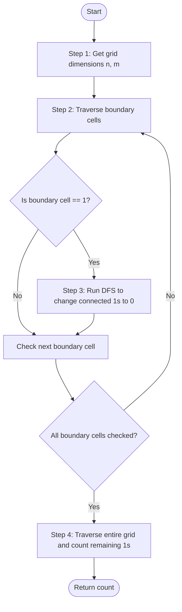

# 💡 Approach — 1s Surrounded by 0s

| 📄 [Problem](./Problem.md) | 💡 [Approach](./Approach.md) | 🧩 [Solution](./Solution.cpp) | 🚀 [Main](./Main.cpp) |
|:--------------------------:|:-----------------------------:|:------------------------------:|:---------------------:|

---

---

> [!TIP]
> **Core Insight:**  
> Any land cell (`1`) that can escape must have a path of adjacent `1`s leading to the boundary of the grid. 
> 
> Instead of checking each internal `1` to see if it can reach a boundary, we can work backwards from the boundaries:
> 1. Start from all `1`s located on the outer border.
> 2. Perform a graph traversal (DFS or BFS) to visit all reachable `1`s from these boundary cells and mark them (e.g., turn them into `0` or another value to denote they can escape).
> 3. After completing the traversals, any `1` left in the grid is an enclave (cannot escape). We simply count the remaining `1`s.

---

## 🔩 Step-by-Step Breakdown

### Step 1: Initialize Grid Dimensions
- Read the number of rows $n$ and columns $m$ from the input grid.

### Step 2: Traverse and Flood Fill from Grid Boundaries
- Loop through the first and last rows ($i = 0$ and $i = n - 1$), and the first and last columns ($j = 0$ and $j = m - 1$).
- If `grid[i][j] == 1`, call the helper function `dfs(i, j)` to sink all connected `1`s to `0`.

### Step 3: DFS Helper Routine
- For a cell $(r, c)$, check if it is within bounds and if `grid[r][c] == 1`. If not, return.
- Mark `grid[r][c] = 0` (sunk).
- Recursively call DFS on the four adjacent directions: Up $(r-1, c)$, Down $(r+1, c)$, Left $(r, c-1)$, and Right $(r, c+1)$.

### Step 4: Count Remaining Enclaves
- Iterate through the entire grid using nested loops.
- Count the number of cells that are still `1`.
- Return the accumulated count.

---

## 🔄 Mermaid Flowchart

---

## 📊 Complexity Analysis

| Type | Complexity | Description |
| :--- | :--- | :--- |
| **Time Complexity** | $$O(n \times m)$$ | Every cell in the grid is visited at most a constant number of times during the boundary-driven DFS traversal and final counting scan. |
| **Auxiliary Space** | $$O(n \times m)$$ | In the worst-case scenario (e.g., all cells are `1`), the recursion stack for DFS can grow to the size of the grid. Can be optimized to $$O(\min(n, m))$$ using BFS. |

---

> *"The boundary is not the limit; it is the beginning of understanding what lies within."* — Unknown

---

<h3>Happy Coding! 🚀</h3>

