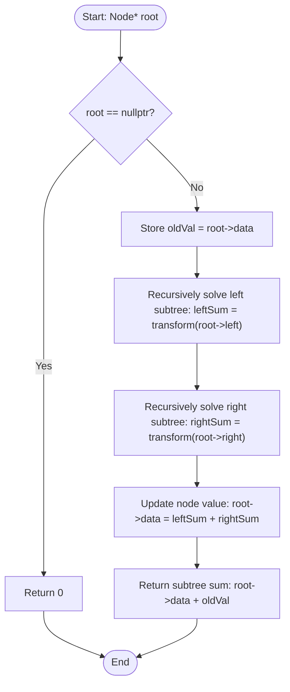

# 💡 Approach — Transform to Sum Tree

| 📄 [Problem](./Problem.md) | 💡 [Approach](./Approach.md) | 🧩 [Solution](./Solution.cpp) | 🚀 [Main](./Main.cpp) |
|:--------------------------:|:-----------------------------:|:------------------------------:|:---------------------:|

---

## 📊 Metadata

### 🏢 Companies
- 
 
 
 
 

---

> [!TIP]
> **Core Insight:**  
> For any node in the tree, its new value is the sum of all values in its left and right subtrees in the original tree.
> 
> If we process the tree using a **Post-order Traversal (Bottom-Up DFS)**:
> 1. We first compute the sum of the left and right subtrees recursively.
> 2. The original sum of the subtree rooted at `root` is: `original_value(root) + sum_of_left_subtree + sum_of_right_subtree`.
> 3. The new value of the `root` node should be updated to: `sum_of_left_subtree + sum_of_right_subtree`.
> 4. We return the original sum of this subtree back to the parent so that the parent can compute its own new value.

---

## 🔩 Step-by-Step Breakdown

### Step 1: Base Case for Null Nodes
- If the current node is `nullptr`, return $0$ as it has no value.

### Step 2: Recursive Subtree Summation
- Recursively call the transform function on the left child to get the total original sum of the left subtree: `leftSum = transform(root->left)`.
- Recursively call the transform function on the right child to get the total original sum of the right subtree: `rightSum = transform(root->right)`.

### Step 3: Update Current Node Value
- Store the original value of the current node: `oldVal = root->data`.
- Update the current node's value to the sum of the left and right subtree sums: `root->data = leftSum + rightSum`.

### Step 4: Return Subtree Total Sum
- Return the sum of all original node values in the subtree rooted at the current node, which is `root->data + oldVal` (new node value + old node value).

---

## 🔄 Mermaid Flowchart

---

## 📊 Complexity Analysis

| Type | Complexity | Description |
| :--- | :--- | :--- |
| **Time Complexity** | $O(n)$ | We visit each node of the binary tree exactly once. |
| **Auxiliary Space** | $O(h)$ | The space is used by the recursion call stack, which is proportional to the height of the tree $h$. In the worst case (skewed tree), $h = O(n)$; in the best case (balanced tree), $h = O(\log n)$. |

---

> *"Recursion is the root of elegance in data structures."* — Unknown

---

<h3>Happy Coding! 🚀</h3>

