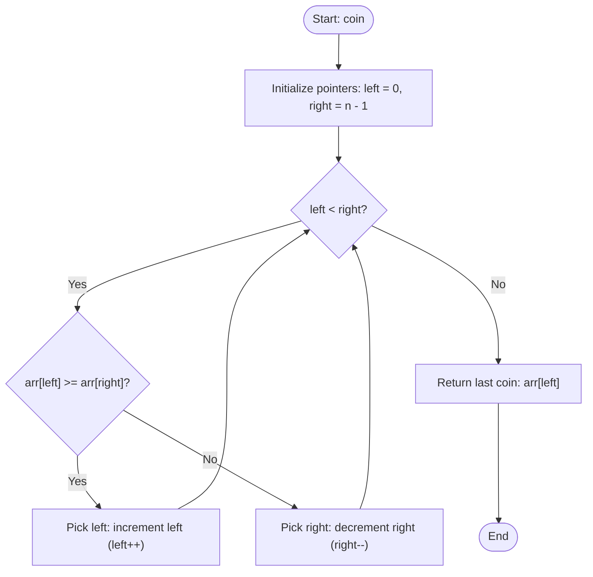

# 💡 Approach — Last Coin in a Game of Alternates

| 📄 [Problem](./Problem.md) | 💡 [Approach](./Approach.md) | 🧩 [Solution](./Solution.cpp) | 🚀 [Main](./Main.cpp) |
|:--------------------------:|:-----------------------------:|:------------------------------:|:---------------------:|

---

## 📊 Metadata

---

> [!TIP]
> **Core Insight:**  
> The game alternates between two players who always play greedily, picking the maximum value between the two available endpoints. 
> 
> By utilizing a **Two-Pointer Simulation**:
> 1. We keep two boundary pointers: `left` at the start of the array and `right` at the end of the array.
> 2. At each turn, the players compare the values at `arr[left]` and `arr[right]`.
> 3. The larger value is picked and removed from play (which corresponds to narrowing our search space by shifting the pointer that points to the larger value).
> 4. We repeat this process until only one element is left (`left == right`), which is the last remaining coin.

---

## 🔩 Step-by-Step Breakdown

### Step 1: Initialize Two Pointers
- Initialize `left = 0` to point to the start of the array.
- Initialize `right = arr.size() - 1` to point to the end of the array.

### Step 2: Compare and Narrow Down
- Loop while `left < right`:
  - Compare the elements at `arr[left]` and `arr[right]`.

### Step 3: Shift Pointers Based on Greedy Strategy
- If `arr[left] >= arr[right]`, the current player takes the coin at `left`. Thus, we increment `left` to shrink the array from the left side (`left++`).
- Otherwise, the player takes the coin at `right`. We decrement `right` to shrink the array from the right side (`right--`).

### Step 4: Return Last Coin
- When the loop terminates, `left == right`. Return the coin value at the remaining index: `arr[left]`.

---

## 🔄 Mermaid Flowchart

---

## 📊 Complexity Analysis

| Type | Complexity | Description |
| :--- | :--- | :--- |
| **Time Complexity** | $O(n)$ | The algorithm traverses the array from both ends using two pointers, performing $O(1)$ operations per step. The array is traversed exactly once. |
| **Auxiliary Space** | $O(1)$ | No extra memory or recursion is used. Only two integer pointers (`left` and `right`) are maintained. |

---

> *"Greedy algorithms work when local choices lead to a globally optimal solution."* — Unknown

---

<h3>Happy Coding! 🚀</h3>

