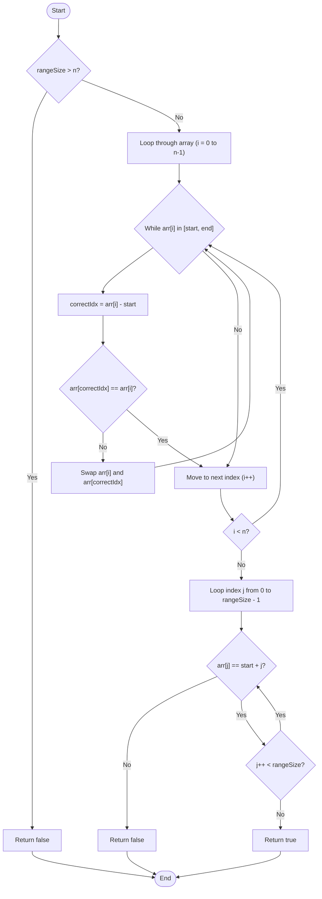

# 💡 Approach — Elements in the Range

| 📄 [Problem](./Problem.md) | 💡 [Approach](./Approach.md) | 🧩 [Solution](./Solution.cpp) | 🚀 [Main](./Main.cpp) |
|:--------------------------:|:-----------------------------:|:------------------------------:|:---------------------:|

---

## 📊 Metadata

---

> [!TIP]
> **Core Insight:**  
> Since the array contains distinct positive integers, any element $x \in [\text{start}, \text{end}]$ should ideally be placed at the index $x - \text{start}$ of the array.
>
> We can achieve an $O(n)$ time complexity and $O(1)$ auxiliary space by using a **Cycle Sort** variation:
> 1. Iterate through the array. For each element, if it falls in the range $[\text{start}, \text{end}]$, we swap it with the element at index `arr[i] - start`.
> 2. We repeat this swap process until the element at index `i` is either out of the range $[\text{start}, \text{end}]$, or it is already equal to the element at its correct target index.
> 3. Finally, we verify if every index $i$ from $0$ to $\text{end} - \text{start}$ contains the element $i + \text{start}$.

---

## 🔩 Step-by-Step Breakdown

### Step 1: Handle Base Condition
- Calculate the total count of numbers in the range: `rangeSize = end - start + 1`.
- If `rangeSize > n` (the array size), it is mathematically impossible to contain all elements since the array contains distinct elements. Return `false` immediately.

### Step 2: Cycle Sort Elements
- Loop through the array from `i = 0` to `n - 1`.
- While the current element `arr[i]` falls within the range `[start, end]`:
  - Calculate its target index: `correctIdx = arr[i] - start`.
  - If `arr[correctIdx] == arr[i]`, then the element is already at its correct position. Break the loop to avoid infinite cycling.
  - Otherwise, swap `arr[i]` with `arr[correctIdx]`.

### Step 3: Validate the Range
- Loop through the indices from `0` to `rangeSize - 1`.
- For each index `i`, check if the element `arr[i]` is equal to `start + i`.
- If any element doesn't match, it means `start + i` is missing from the array. Return `false`.
- If all elements match, return `true`.

---

## 🔄 Mermaid Flowchart

---

## 📊 Complexity Analysis

| Type | Complexity | Description |
| :--- | :--- | :--- |
| **Time Complexity** | $O(n)$ | Although there is a nested `while` loop, each swap places at least one element in its correct target position. Since an element is swapped at most once to its correct position, the total number of swaps across the entire array is at most $O(n)$. The verification step also takes $O(n)$ time. |
| **Auxiliary Space** | $O(1)$ | No extra memory or dynamic data structures are used. The rearrangement is done entirely in-place. |

---

> *"An algorithm must be seen to be believed."* — **Donald Knuth**

---

<h3>Happy Coding! 🚀</h3>

