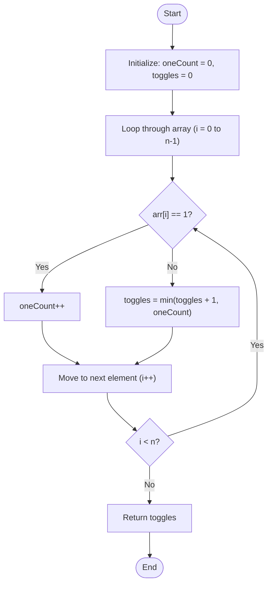

# 💡 Approach — Minimum Toogles to partition

| 📄 [Problem](./Problem.md) | 💡 [Approach](./Approach.md) | 🧩 [Solution](./Solution.cpp) | 🚀 [Main](./Main.cpp) |
|:--------------------------:|:-----------------------------:|:------------------------------:|:---------------------:|

---

## 📊 Metadata

---

> [!TIP]
> **Core Insight:**  
> A partitioned binary array must consist of all `0`s grouped together at the front, followed by all `1`s grouped together at the back.
>
> If we process the array from left to right, we can dynamically build the partition cost for the prefix `arr[0...i]`. At the current element `arr[i]`:
> 1. If it's `1`, it can easily be appended to a partitioned prefix without modifying its cost. We just increment our count of `1`s.
> 2. If it's `0`, we have a decision to make to keep the prefix partitioned:
>    - **Option A:** Toggle the current `0` to a `1` (which costs `toggles + 1`).
>    - **Option B:** Keep the current `0` as `0` and toggle all previously encountered `1`s to `0`s (which costs `oneCount`).
>
> By choosing `toggles = min(toggles + 1, oneCount)`, we guarantee the minimum toggles needed for the prefix ending at `i` in $O(1)$ time at each step.

---

## 🔩 Step-by-Step Breakdown

### Step 1: Initialize State Variables
- Initialize `oneCount = 0` to track the number of `1`s encountered.
- Initialize `toggles = 0` to track the minimum toggle cost to partition the prefix array.

### Step 2: Traverse the Array
- Loop through each element `arr[i]` of the array from index `0` to `n - 1`:
  - If `arr[i] == 1`, increment `oneCount`.
  - If `arr[i] == 0`, update `toggles` to the minimum of:
    - `toggles + 1` (flipping the current `0` to `1` so it belongs to the `1`s suffix).
    - `oneCount` (flipping all previous `1`s to `0`s so the entire prefix becomes `0`s).

### Step 3: Return the Result
- After traversing the entire array, return the value of `toggles`.

---

## 🔄 Mermaid Flowchart

---

## 📊 Complexity Analysis

| Type | Complexity | Description |
| :--- | :--- | :--- |
| **Time Complexity** | $O(n)$ | We perform exactly one traversal over the array of size $n$, doing constant time $O(1)$ operations per element. |
| **Auxiliary Space** | $O(1)$ | No additional data structures are created; we only store a couple of scalar integer variables. |

---

> *"Dynamic programming is not about caching, it's about ordering state transitions to make the future independent of the past."* — **Anonymous**

---

<h3>Happy Coding! 🚀</h3>

