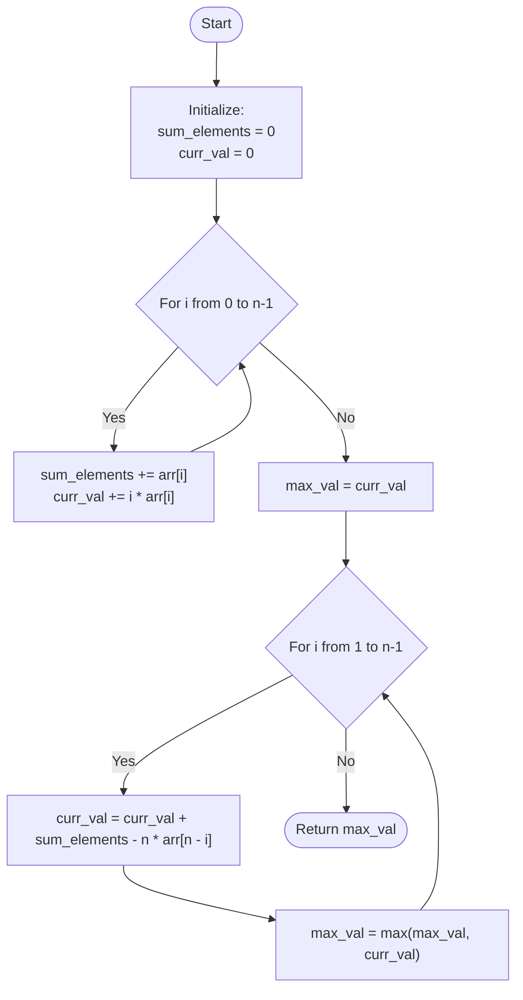

# Approach: Mathematics & Prefix Sum Logic

  <a href="./Problem.md"><strong>Problem Statement</strong></a> |
  <a href="./Solution.cpp"><strong>Solution.cpp</strong></a> |
  <a href="./Main.cpp"><strong>Main.cpp</strong></a>

 

## 💡 Intuition

The problem asks for the maximum value of the sum $\sum (i \times arr[i])$ across all possible rotations of the array.

A brute-force solution would calculate the sum for every possible rotation. For an array of size $N$, there are $N$ possible rotations, and each calculation takes $\mathcal{O}(N)$ time. This gives an $\mathcal{O}(N^2)$ algorithm, which will time out for $N = 10^4$.

We need a way to calculate the sum of the *next* rotation in $\mathcal{O}(1)$ time. 
Let $S_0$ be the value for the initial array:
$S_0 = 0 \times arr[0] + 1 \times arr[1] + 2 \times arr[2] + ... + (n-1) \times arr[n-1]$

When we rotate the array by one position (e.g., clockwise shift where the last element comes to the front):
$S_1 = 0 \times arr[n-1] + 1 \times arr[0] + 2 \times arr[1] + ... + (n-1) \times arr[n-2]$

Let's subtract $S_0$ from $S_1$:
$S_1 - S_0 = arr[0] + arr[1] + ... + arr[n-2] - (n-1) \times arr[n-1]$

We can rewrite the sum $arr[0] + arr[1] + ... + arr[n-2]$ as the sum of all elements in the array (`sum_elements`) minus $arr[n-1]$:
$S_1 - S_0 = (sum\_elements - arr[n-1]) - (n-1) \times arr[n-1]$
$S_1 - S_0 = sum\_elements - n \times arr[n-1]$
$S_1 = S_0 + sum\_elements - n \times arr[n-1]$

We can generalize this! The value of the $k$-th rotation can be calculated from the $(k-1)$-th rotation:
$S_k = S_{k-1} + sum\_elements - n \times arr[n-k]$

## 🛠️ Algorithm

1. Find the sum of all elements in the array (`sum_elements`).
2. Find the initial value of $S_0$ (i.e., $\sum i \times arr[i]$) and store it in `curr_val`.
3. Set `max_val = curr_val`.
4. Iterate from $i = 1$ to $n-1$:
   - Calculate the value of the next rotation in $\mathcal{O}(1)$ using the formula:
     `curr_val = curr_val + sum_elements - (n * arr[n - i])`
   - Update `max_val = max(max_val, curr_val)`.
5. Return `max_val`.

## 📊 Visual Representation

## ⏳ Complexity Analysis

- **Time Complexity:** $\mathcal{O}(N)$. We loop through the array twice. The first loop calculates `sum_elements` and `S_0` in $\mathcal{O}(N)$. The second loop calculates the remaining $N-1$ rotation values in $\mathcal{O}(1)$ each, totalling $\mathcal{O}(N)$.
- **Space Complexity:** $\mathcal{O}(1)$. We only use a few variables to store sums and maximum values, taking constant extra space.

## 🚶‍♂️ Example Walkthrough

**Input:** `arr = [3, 1, 2, 8]`, $n = 4$

1. **Initialization:**
   - `sum_elements` = $3 + 1 + 2 + 8 = 14$
   - `curr_val` ($S_0$) = $0 \times 3 + 1 \times 1 + 2 \times 2 + 3 \times 8 = 0 + 1 + 4 + 24 = 29$
   - `max_val` = $29$
2. **First Rotation ($i=1$):**
   - The element that moved from end to front is $arr[4-1] = arr[3] = 8$.
   - `curr_val` ($S_1$) = $29 + 14 - 4 \times 8 = 43 - 32 = 11$
   - `max_val` = $\max(29, 11) = 29$
3. **Second Rotation ($i=2$):**
   - The element that moved is $arr[4-2] = arr[2] = 2$.
   - `curr_val` ($S_2$) = $11 + 14 - 4 \times 2 = 25 - 8 = 17$
   - `max_val` = $\max(29, 17) = 29$
4. **Third Rotation ($i=3$):**
   - The element that moved is $arr[4-3] = arr[1] = 1$.
   - `curr_val` ($S_3$) = $17 + 14 - 4 \times 1 = 31 - 4 = 27$
   - `max_val` = $\max(29, 27) = 29$

**Final Output:** $29$

---

Happy Coding! 🚀  

