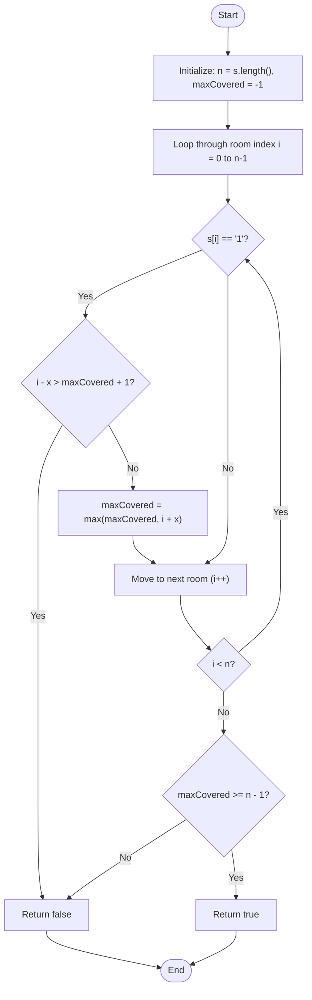

# 💡 Approach — Wifi Range

| 📄 [Problem](./Problem.md) | 💡 [Approach](./Approach.md) | 🧩 [Solution](./Solution.cpp) | 🚀 [Main](./Main.cpp) |
|:--------------------------:|:-----------------------------:|:------------------------------:|:---------------------:|

---

## 📊 Metadata

---

> [!TIP]
> **Core Insight:**  
> To check if all rooms are covered in $O(n)$ time and $O(1)$ auxiliary space, we can process rooms from left to right while keeping track of the rightmost index covered so far (`maxCovered`).
>
> When we encounter a router at index `i` (where `s[i] == '1'`):
> 1. Its coverage spans from `i - x` to `i + x`.
> 2. For the array to be contiguous (no uncovered rooms), the left boundary of this router's coverage (`i - x`) must overlap with or be immediately adjacent to the current maximum covered index. Specifically, if `i - x > maxCovered + 1`, there is a gap that can never be covered by this or any subsequent routers to the right. In this case, we immediately return `false`.
> 3. Otherwise, we extend our coverage range to `max(maxCovered, i + x)`.
>
> Finally, after scanning the hostel, we check if the entire line of rooms is covered by validating if `maxCovered >= n - 1` (where $n$ is the length of string $s$).

---

## 🔩 Step-by-Step Breakdown

### Step 1: Initialize State Variables
- Determine $n$ as the length of the string `s`.
- Initialize `maxCovered = -1` to keep track of the rightmost index covered by a WiFi router so far.

### Step 2: Traverse the String
- Loop through each room index `i` from `0` to `n - 1`:
  - If `s[i] == '1'`, a router is present at room `i`:
    - Check if the router's left range boundary `i - x` leaves an uncovered gap. If `i - x > maxCovered + 1`, return `false`.
    - Otherwise, update `maxCovered = max(maxCovered, i + x)` to represent the new rightmost boundary covered.

### Step 3: Return the Final Check
- After the traversal, verify if the entire hostel of size $n$ is covered by checking if `maxCovered >= n - 1`. Return `true` if it is, and `false` otherwise.

---

## 🔄 Mermaid Flowchart

---

## 📊 Complexity Analysis

| Type | Complexity | Description |
| :--- | :--- | :--- |
| **Time Complexity** | $O(n)$ | We scan the string of length $n$ exactly once, doing $O(1)$ operations at each room. |
| **Auxiliary Space** | $O(1)$ | No additional structures or dynamic tables are allocated; we only maintain one integer variable `maxCovered`. |

---

> *"In the optimization of space and time, the simplest trackers often yield the most elegant bounds."* — **Anonymous**

---

<h3>Happy Coding! 🚀</h3>

