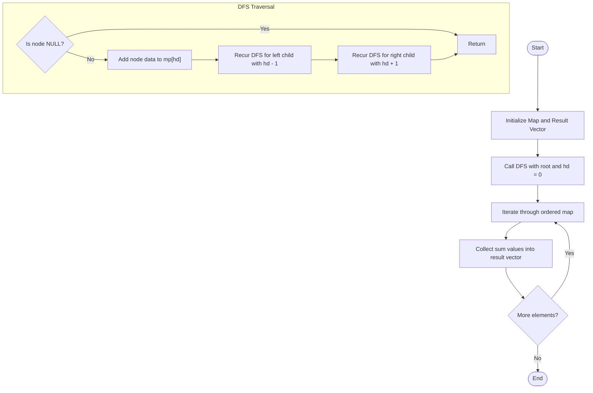

# 💡 Approach — Vertical Sum

| 📄 [Problem](./Problem.md) | 💡 [Approach](./Approach.md) | 🧩 [Solution](./Solution.cpp) | 🚀 [Main](./Main.cpp) |
|:--------------------------:|:-----------------------------:|:------------------------------:|:---------------------:|

---

## 📊 Metadata

---

> [!TIP]
> **Core Insight:**  
> We can conceptualize vertical lines in a binary tree using a **Horizontal Distance (HD)** system:
> - The root node has an HD of $0$.
> - Moving to the left child decreases the HD by $1$ ($\text{HD}_{\text{left}} = \text{HD} - 1$).
> - Moving to the right child increases the HD by $1$ ($\text{HD}_{\text{right}} = \text{HD} + 1$).
>
> Nodes that lie on the same vertical line will have the same Horizontal Distance. By traversing the binary tree using a Depth-First Search (DFS) or Breadth-First Search (BFS) and keeping track of the current HD, we can accumulate the values of all nodes at each HD.
> 
> Using `std::map<int, int>` in C++ to store the mapping of `HD -> Sum` is extremely convenient because a `std::map` keeps its keys in sorted order. Once the traversal completes, we can iterate through the map, and the keys (and thus the sums) will automatically be processed from the leftmost vertical line (smallest negative HD) to the rightmost vertical line (largest positive HD).

---

## 🔩 Step-by-Step Breakdown

### Step 1: Initialize State Variables
- Create a hash map or ordered map `std::map<int, int> mp` where key represents the Horizontal Distance (HD) and value represents the cumulative vertical sum.
- Create a container `std::vector<int> res` to hold the final sorted vertical sums.

### Step 2: Traverse the Binary Tree
- Execute a helper DFS function `solve(node, hd, mp)` starting with the root node and `hd = 0`.
- Inside the recursive function:
  - If the node is `nullptr`, return immediately.
  - Add the current node's value (`node->data`) to the sum mapped to the current horizontal distance (`mp[hd] += node->data`).
  - Recursively visit the left subtree with updated distance `hd - 1`.
  - Recursively visit the right subtree with updated distance `hd + 1`.

### Step 3: Collect and Return Results
- After the traversal completes, iterate through the ordered map `mp`.
- Since the map elements are sorted by their key (horizontal distance), pushing the values into `res` will naturally order the sums from the leftmost vertical line to the rightmost vertical line.
- Return `res`.

---

## 🔄 Mermaid Flowchart

---

## 📊 Complexity Analysis

| Type | Complexity | Description |
| :--- | :--- | :--- |
| **Time Complexity** | $O(n \log k)$ | We traverse all $n$ nodes of the binary tree exactly once. For each node, inserting or updating the value in `std::map` takes $O(\log k)$ time, where $k$ is the number of vertical lines (width of the tree). Since $k \le n$, the total time complexity is bounded by $O(n \log k)$. |
| **Auxiliary Space** | $O(n)$ | In the worst-case of a skewed tree, the recursion stack takes $O(n)$ space. The map stores $k$ key-value pairs where $k \le n$, leading to a total auxiliary space complexity of $O(n)$. |

---

> *"In the branch of every tree, there lies a sum of paths waiting to be discovered."* — **Anonymous**

---

<h3>Happy Coding! 🚀</h3>

