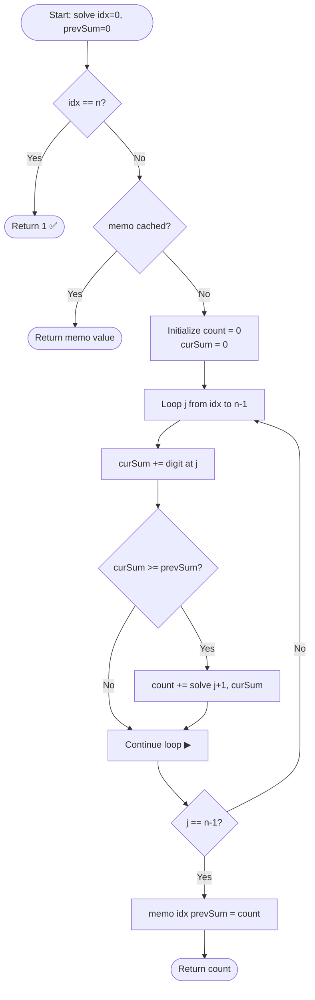

# 💡 Approach — Count Sorted Digit Groupings

| 📄 [Problem](./Problem.md) | 💡 [Approach](./Approach.md) | 🧩 [Solution](./Solution.cpp) | 🚀 [Main](./Main.cpp) |
|:--------------------------:|:-----------------------------:|:------------------------------:|:---------------------:|

---

## 📊 Metadata

---

## 🧠 Core Insight

> [!TIP]
> The key observation is that at every index `i`, we can start a new sub-group and extend it rightward. The only constraint is that the **digit sum** of the new sub-group must be **≥** the digit sum of the previously formed sub-group. This defines a **top-down DP with memoization** over two state dimensions: the current **starting index** and the **previous group's digit sum**. Since the string length is at most 100 and each digit is at most 9, the maximum possible previous sum is `100 × 9 = 900`, making an `O(n × maxSum)` memo table perfectly feasible.

---

## 🔩 Step-by-Step Breakdown

**Step 1 — Define the State**
- Let `solve(idx, prevSum)` return the number of valid groupings of `s[idx..n-1]` where the immediately preceding group had a digit sum of `prevSum`.
- **Base case:** If `idx == n` (entire string consumed), one complete valid grouping found → return `1`.

**Step 2 — Memoize**
- Declare `memo[101][901]` initialized to `-1`.
- Before recursing, check `memo[idx][prevSum] != -1`; if so, return it immediately.

**Step 3 — Iterate Over All Possible Next Substrings**
- From the current position `idx`, extend a window `j` from `idx` to `n-1`.
- Accumulate `curSum += s[j] - '0'` incrementally (avoids recomputing from scratch — this is the $O(n)$ inner loop).

**Step 4 — Prune Invalid Splits**
- If `curSum < prevSum`, this extension violates the non-decreasing constraint → **skip** (but keep extending, since adding more digits can only increase `curSum`).

**Step 5 — Recurse on Valid Splits**
- If `curSum >= prevSum`, recurse: `count += solve(j + 1, curSum)`.

**Step 6 — Store & Return**
- Store result in `memo[idx][prevSum]` before returning.

**Step 7 — Entry Point**
- Call `solve(0, 0)` — start from index 0 with a previous sum of 0 (neutral lower bound, any positive sum qualifies).

---

## 🔄 Mermaid Flowchart

---

## 📊 Complexity Analysis

| Dimension | Complexity | Reasoning |
|:---------:|:----------:|:----------|
| 🕒 Time   | $O(n^3)$   | $O(n^2)$ unique states × $O(n)$ inner loop per state |
| 🗃️ Space  | $O(n^2)$   | Memo table of size $n \times \text{maxSum}$ ≈ $100 \times 901$ |

> **Note:** The memo table size is technically $O(n \times \text{maxSum})$ where `maxSum = 9n`, which simplifies to $O(n^2)$.

---

## 🔍 Dry Run — `s = "1119"`

| Call | idx | prevSum | Window Explored | Valid Splits Found |
|:----:|:---:|:-------:|:---------------:|:-----------------:|
| Entry | 0 | 0 | "1", "11", "111", "1119" | All (≥ 0) |
| Recurse | 1 | 1 | "1"(1≥1✅), "11"(2≥1✅), "119"(11≥1✅) | 3 branches |
| Recurse | 2 | 1 | "1"(1≥1✅), "19"(10≥1✅) | 2 branches |
| Recurse | 3 | 1 | "9"(9≥1✅) | 1 branch |
| Base | 4 | — | — | Return 1 |

Total valid paths = **7** ✅

---

> *"The art of programming is the art of organizing complexity."*
> — **Edsger W. Dijkstra**

---

<h3>Happy Coding! 🚀</h3>

