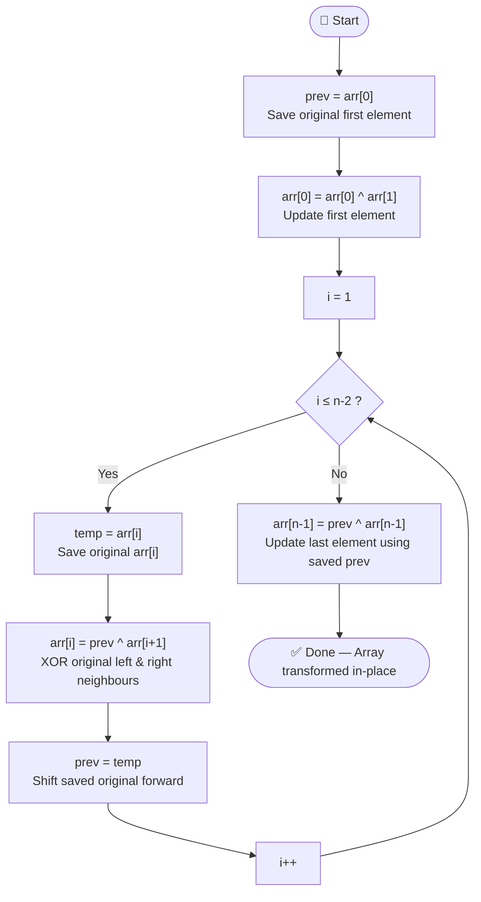

# 💡 Approach — Replace with XOR of Adjacent

| 📄 [Problem](./Problem.md) | 💡 [Approach](./Approach.md) | 🧩 [Solution](./Solution.cpp) | 🚀 [Main](./Main.cpp) |
|:--------------------------:|:-----------------------------:|:------------------------------:|:---------------------:|

---

## 📊 Metadata

---

## 🧠 Core Insight

> [!TIP]
> The key challenge is that every element must be replaced using the **original** values of its neighbours — not values already modified in the same pass.
>
> Instead of using an auxiliary array (which costs **O(n)** space), we can maintain a single `prev` variable that tracks the **original value of the left neighbour** as we sweep left-to-right. This lets us perform the transformation **in-place in O(1) extra space**.

---

## 🔩 Step-by-Step Breakdown

**Step 1 — Save the original first element.**
Before modifying anything, store `prev = arr[0]`. This value will be used as the "original left neighbour" for `arr[1]`.

**Step 2 — Update the first element.**
`arr[0]` has only one neighbour: `arr[1]`.
Apply: `arr[0] = arr[0] ^ arr[1]`.

**Step 3 — Sweep through middle elements (`i = 1` to `n-2`).**
For each index `i`:
1. Save `temp = arr[i]` (original value of current element, needed as `prev` for next iteration).
2. Compute `arr[i] = prev ^ arr[i+1]` (original left neighbour XOR original right neighbour — `arr[i+1]` is still unmodified).
3. Update `prev = temp`.

**Step 4 — Update the last element.**
`arr[n-1]` has only one neighbour on the left. At this point `prev` holds the original value of `arr[n-2]`.
Apply: `arr[n-1] = prev ^ arr[n-1]`.

---

## 🔄 Mermaid Flowchart

---

## 🔍 Dry Run — Example 1

`arr = [2, 1, 4, 7]`

| Step | Action | `prev` | Array State |
|:----:|:------:|:------:|:-----------:|
| Init | `prev = arr[0]` | `2` | `[2, 1, 4, 7]` |
| Step 2 | `arr[0] = 2^1 = 3` | `2` | `[3, 1, 4, 7]` |
| i=1 | `temp=1`, `arr[1]=2^4=6`, `prev=1` | `1` | `[3, 6, 4, 7]` |
| i=2 | `temp=4`, `arr[2]=1^7=6`, `prev=4` | `4` | `[3, 6, 6, 7]` |
| Step 4 | `arr[3]=4^7=3` | — | `[3, 6, 6, 3]` ✅ |

---

## 📊 Complexity Analysis

| Complexity Type  | Value  | Reasoning |
|:----------------:|:------:|:---------:|
| **Time**         | `O(n)` | Single left-to-right sweep through the array |
| **Auxiliary Space** | `O(1)` | Only two scalar variables (`prev`, `temp`) used |

---

> *"The art of programming is the art of organizing complexity."*
> — **Edsger W. Dijkstra**

---

<h3>Happy Coding! 🚀</h3>

