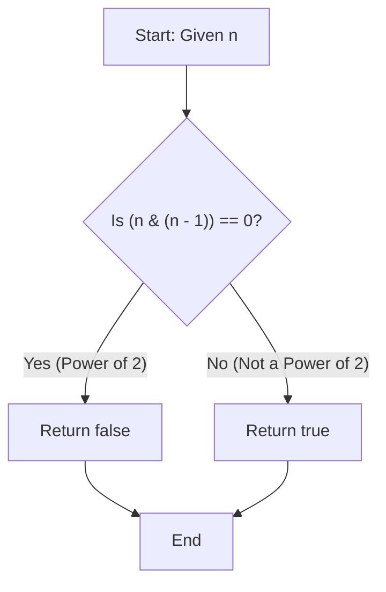

# 💡 Approach — Express as Consecutive Number Sum

| 📄 [Problem](./Problem.md) | 💡 [Approach](./Approach.md) | 🧩 [Solution](./Solution.cpp) | 🚀 [Main](./Main.cpp) |
|:--------------------------:|:-----------------------------:|:------------------------------:|:---------------------:|

## 📊 Metadata

-blue?style=for-the-badge)
-blue?style=for-the-badge)

> [!TIP]
> **Core Insight:** A number can be expressed as a sum of two or more consecutive positive integers if and only if it is **not a power of 2**. Mathematically, any number with an odd factor greater than 1 can be represented as a sum of consecutive integers. Since powers of 2 have no odd factors, they cannot be formed this way.

## 🔩 Step-by-Step Breakdown
1. **Check if the Number is a Power of 2**: If `n` is a power of 2, it only has `2` as its prime factors and cannot have any odd divisor $> 1$.
2. **Bitwise Trick**: We can check if a number is a power of 2 using the bitwise operation `(n & (n - 1))`. 
3. **Return Result**: If `(n & (n - 1)) == 0`, then `n` is a power of 2, so return `false`. Otherwise, return `true` because it must contain an odd factor and can be expressed as a sum of consecutive positive numbers.

## 🔄 Mermaid Flowchart

## 📊 Complexity Analysis

| Complexity | Analysis |
|:---|:---|
| **Time** | $\mathcal{O}(1)$ — A single bitwise operation is performed. |
| **Space** | $\mathcal{O}(1)$ — No extra memory is used. |

> *"Simplicity is the ultimate sophistication."*

---

<h3>Happy Coding! 🚀</h3>

