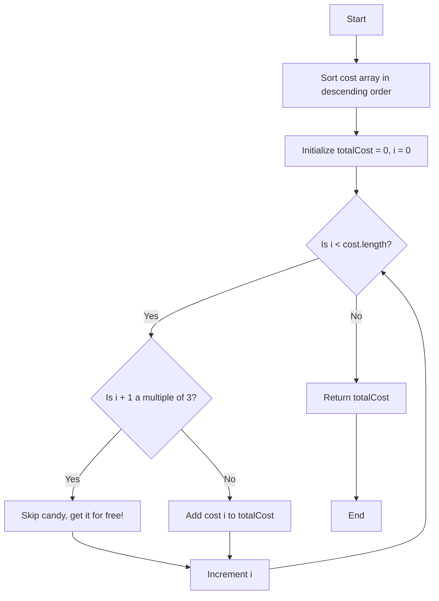

# 💡 Approach — Minimum Cost of Buying Candies With Discount

| 📄 [Problem](./Problem.md) | 💡 [Approach](./Approach.md) | 🧩 [Solution](./Solution.cpp) | 🚀 [Main](./Main.cpp) |
|:--------------------------:|:-----------------------------:|:------------------------------:|:---------------------:|

## 📊 Metadata

> [!TIP]
> **Core Insight:** 
> To minimize the total cost, we want the most expensive candies to be the ones we get for free. Since we can only get a candy for free if its cost is less than or equal to the minimum of two bought candies, we should greedily buy the most expensive candies and claim the next most expensive candy as the free one. Sorting the array in descending order helps us pair up every two expensive candies and skip the third one!

## 🔩 Step-by-Step Breakdown

1. **Sort the Candies:** Sort the `cost` array in descending order so that the most expensive candies are at the beginning.
2. **Iterate Greedily:** Loop through the sorted array. For every three consecutive candies, the first two are bought, and the third one is taken for free.
3. **Accumulate Cost:** Add the cost of a candy to the total cost if its index (1-based) is not a multiple of 3. In 0-based indexing, this means adding `cost[i]` if `(i + 1) % 3 != 0`.
4. **Return Result:** Return the final accumulated total cost.

## 🔄 Mermaid Flowchart

## 📊 Complexity Analysis

| Complexity | Measure | Reason |
|:---:|:---:|:---|
| **Time** | $O(n \log n)$ | Sorting the array dominates the time complexity. |
| **Space** | $O(1)$ | No extra auxiliary space is used other than variables (assuming in-place sorting). |

> *"Simplicity is the soul of efficiency."* — Austin Freeman

---

<h3>Happy Coding! 🚀</h3>

