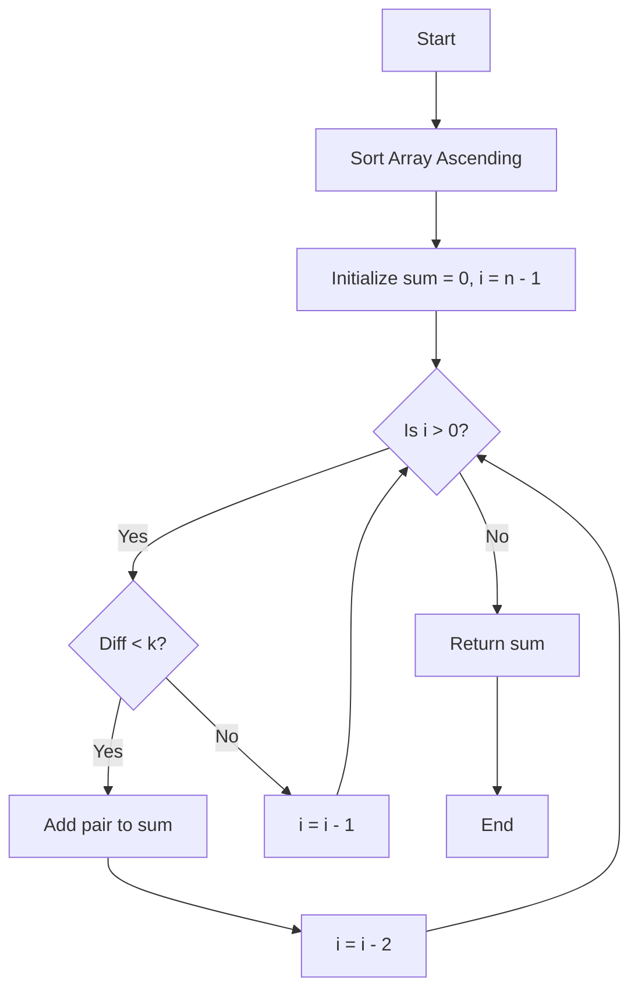

# 💡 Approach — Pairs with certain difference

| 📄 [Problem](./Problem.md) | 💡 [Approach](./Approach.md) | 🧩 [Solution](./Solution.cpp) | 🚀 [Main](./Main.cpp) |
|:--------------------------:|:-----------------------------:|:------------------------------:|:---------------------:|

## 📊 Metadata

> [!TIP]
> **Core Insight**
> To maximize the sum of pairs, we should try to pair the largest possible numbers together. Sorting the array helps us quickly find elements that are close to each other in value and as large as possible.

## 🔩 Step-by-Step Breakdown

1. **Sort the Array:** Sort the array in ascending order. This places the largest elements at the end, making it easier to evaluate pairs greedily.
2. **Initialize Variables:** Start with a `sum` initialized to 0 to keep track of the maximum pair sum.
3. **Iterate Backwards:** Traverse the array from the end `i = n - 1` down to 1.
4. **Check Valid Pair:** If the difference between the current element `arr[i]` and the previous element `arr[i-1]` is strictly less than `k` (`arr[i] - arr[i-1] < k`), they form a valid pair.
5. **Add to Sum and Skip:** Since we want to maximize the sum, adding the two largest possible valid elements is always optimal. Add their sum to `sum`, and decrement `i` by 1 to skip the element that was just paired (ensuring pairs are disjoint).
6. **Return Result:** Return the computed `sum`.

## 🔄 Mermaid Flowchart

## 📊 Complexity Analysis

| Complexity | Evaluation | Description |
|:---|:---|:---|
| **Time Complexity** | $$O(n \log n)$$ | Sorting the array takes $$O(n \log n)$$ time. The single traversal takes $$O(n)$$ time, making sorting the dominating factor. |
| **Space Complexity** | $$O(1)$$ or $$O(n)$$ | Sorting typically takes $$O(\log n)$$ or $$O(n)$$ auxiliary space depending on the internal implementation of `std::sort`. The algorithm itself uses $$O(1)$$ space. |

> *"Simplicity is the soul of efficiency."*

---

<h3>Happy Coding! 🚀</h3>

