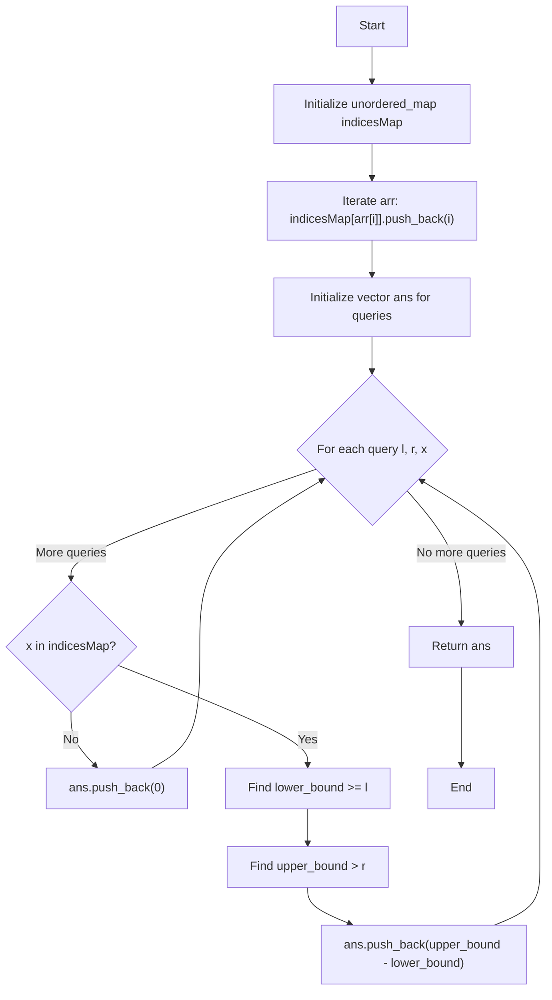

# 💡 Approach — Subarray Frequency Count Queries

| 📄 [Problem](./Problem.md) | 💡 [Approach](./Approach.md) | 🧩 [Solution](./Solution.cpp) | 🚀 [Main](./Main.cpp) |
|:--------------------------:|:-----------------------------:|:------------------------------:|:---------------------:|

## 📊 Metadata

> [!TIP]
> **Core Insight:** We can precompute the positions of each element in the array using a Hash Map that maps an element to a list of its indices. Since we iterate left-to-right, these lists of indices will naturally be sorted. For any query `[l, r, x]`, we can then use Binary Search (`lower_bound` and `upper_bound`) on the list of indices for element `x` to quickly find how many times it appears in the range `[l, r]`.

## 🔩 Step-by-Step Breakdown

1. **Map Element Indices**: Create an `unordered_map<int, vector<int>>` called `indicesMap`. Iterate through the given array `arr` and for each element at index `i`, append `i` to `indicesMap[arr[i]]`.
2. **Process Queries**: Iterate through each query in the `queries` array. Each query gives us `l` (left bound), `r` (right bound), and `x` (the target element).
3. **Check Existence**: First, check if the element `x` exists in our map. If it doesn't, its frequency is `0`.
4. **Binary Search**: If `x` exists, fetch its sorted list of indices.
   - Use `lower_bound` to find the first index in the list that is $\ge l$.
   - Use `upper_bound` to find the first index in the list that is $> r$.
5. **Calculate Frequency**: The difference between the iterators returned by `upper_bound` and `lower_bound` gives the exact frequency of `x` in the subarray `[l, r]`. Append this difference to our results array.

## 🔄 Mermaid Flowchart

## 📊 Complexity Analysis

| Complexity | Analysis |
|:---:|:---|
| **Time** | $\mathcal{O}(n + q \log k)$ where $n$ is the array length, $q$ is the number of queries, and $k$ is the max frequency of an element. Building the map takes $\mathcal{O}(n)$. Each query takes $\mathcal{O}(\log k)$ due to binary search. |
| **Space** | $\mathcal{O}(n)$ to store all the indices in the unordered map. The total size of all vectors in the map is exactly $n$. |

> *"Simplicity is prerequisite for reliability."*

---

<h3>Happy Coding! 🚀</h3>

