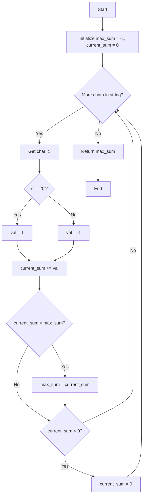

# [Maximum difference of zeros and ones in binary string](https://www.geeksforgeeks.org/problems/maximum-difference-of-zeros-and-ones-in-binary-string4111/1)

| 📄 [Problem](./Problem.md) | 💡 [Approach](./Approach.md) | 🧩 [Solution](./Solution.cpp) | 🚀 [Main](./Main.cpp) |
|:--------------------------:|:-----------------------------:|:------------------------------:|:---------------------:|

## 📊 Metadata

> [!TIP]
> **Core Insight:** Convert the problem into finding the maximum subarray sum by substituting `'0'` with `1` and `'1'` with `-1`. This allows us to use **Kadane's Algorithm** to find the optimal substring efficiently.

## 🔩 Step-by-Step Breakdown
1. **Variable Initialization**: Initialize `max_sum` to `-1` (handling the all-ones edge case inherently) and `current_sum` to `0`.
2. **Iterate through the string**: Process each character one by one.
3. **Value Mapping**: Assign `1` if the character is `'0'` (which increases the difference) and `-1` if it is `'1'` (which decreases the difference).
4. **Update Running Sum**: Add the mapped value to `current_sum`.
5. **Update Maximum Sum**: If `current_sum` is greater than `max_sum`, update `max_sum`.
6. **Reset Negative Sums**: If `current_sum` falls below `0`, reset it to `0`. A negative sum means the current substring contributes negatively to any future contiguous sequence.
7. **Return Result**: Once the loop finishes, `max_sum` holds the maximum difference.

## 🔄 Mermaid Flowchart

## 📊 Complexity Analysis

| Complexity | Details |
|:----------:|:--------|
| **Time** | $\mathcal{O}(n)$ — We traverse the binary string exactly once. |
| **Space** | $\mathcal{O}(1)$ — Only a few integer variables are used for tracking sums. |

> *"Simplicity is prerequisite for reliability."*
> — Edsger W. Dijkstra

---

<h3>Happy Coding! 🚀</h3>

