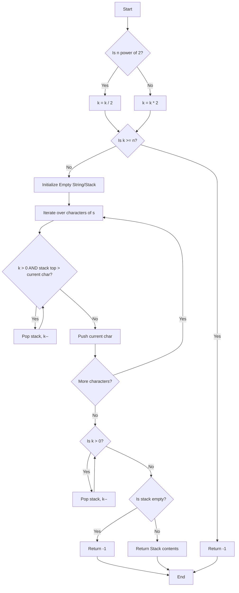

# 💡 Approach — Lexicographically smallest after removing k

| 📄 [Problem](./Problem.md) | 💡 [Approach](./Approach.md) | 🧩 [Solution](./Solution.cpp) | 🚀 [Main](./Main.cpp) |
|:--------------------------:|:-----------------------------:|:------------------------------:|:---------------------:|

## 📊 Metadata

> [!TIP]
> **Core Insight:**  
> To form the lexicographically smallest string after removing exactly `k` characters, we can maintain a monotonic stack. If a character is smaller than the character at the top of the stack, and we still need to remove characters, we should pop the stack. First, we correctly adjust the value of `k` as per the problem constraints.

## 🔩 Step-by-Step Breakdown

1.  **Length Check & `k` Adjustment**:
    -   Find the length of string `s`, denoted as `n`.
    -   Check if `n` is a power of `2` using bitwise operations (`(n & (n - 1)) == 0`).
    -   If it is a power of `2`, halve `k` (`k /= 2`). Otherwise, double `k` (`k *= 2`).
2.  **Feasibility Check**:
    -   If the adjusted `k` is greater than or equal to `n`, it implies we need to remove all or more characters than present in `s`, which results in an empty string. Return `"-1"`.
3.  **Monotonic Stack Construction**:
    -   Iterate through each character `c` of the string `s`.
    -   While the stack (or a resultant string functioning as a stack) is not empty, `k > 0`, and the top element is strictly greater than `c`, pop the top element and decrement `k`.
    -   Push `c` onto the stack.
4.  **Remove Remaining Characters**:
    -   After iterating, if `k > 0`, pop the remaining characters from the end of the stack because the characters are now in non-decreasing order.
5.  **Final Checks**:
    -   Return the resulting string. If the resultant string is empty after all deletions, return `"-1"`.

## 🔄 Mermaid Flowchart

## 📊 Complexity Analysis

| Measure | Complexity | Explanation |
|:---:|:---:|:---|
| **Time Complexity** | $$O(n + k)$$ | We traverse the string once $O(n)$, and each character is pushed and popped at most once. Remaining deletions take $O(k)$ time. |
| **Space Complexity** | $$O(n)$$ | We use a string or a stack to store the answer which takes $O(n)$ space in the worst-case scenario. |

> *"Simplicity is the soul of efficiency."* — Austin Freeman

---

<h3>Happy Coding! 🚀</h3>

