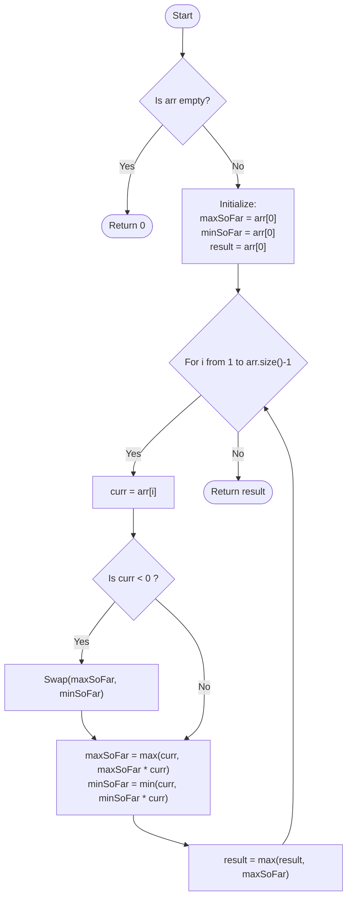

# [Maximum Product Subarray](https://www.geeksforgeeks.org/problems/maximum-product-subarray3604/1)

  <a href="./Problem.md"><strong>Problem Statement</strong></a> |
  <a href="./Solution.cpp"><strong>Solution.cpp</strong></a> |
  <a href="./Main.cpp"><strong>Main.cpp</strong></a>

 

## 💡 Intuition

The problem asks for the maximum product of any contiguous subarray. This is a variation of **Kadane's Algorithm**, which is typically used for the maximum subarray *sum*.

However, dealing with products introduces a trick:
- Multiplying two positive numbers increases the product.
- Multiplying a positive number by a negative number makes it negative (potentially the smallest product).
- Multiplying a **negative** number by another **negative** number makes it positive, which could suddenly become the *largest* product!

Because of this property, we cannot just keep track of the maximum product so far. We must also keep track of the **minimum product so far** (the most negative product). When we encounter a negative number in the array, the previous minimum product (a large negative number) multiplied by this current negative number will flip sign and potentially become the new maximum product.

## 🛠️ Algorithm

1. Initialize `maxSoFar`, `minSoFar`, and `result` with the first element of the array.
2. Iterate through the array starting from the second element (index 1):
   - Let the current element be `curr`.
   - **Crucial Step:** If `curr` is negative, multiplying it by the current `maxSoFar` will make it extremely small, and multiplying it by `minSoFar` will make it extremely large. Therefore, when `curr < 0`, we **swap** `maxSoFar` and `minSoFar`.
   - Update `maxSoFar`: It's either just the current element itself (starting a new subarray), or the current element multiplied by the previous `maxSoFar`. `maxSoFar = max(curr, maxSoFar * curr)`.
   - Update `minSoFar`: It's either just the current element itself, or the current element multiplied by the previous `minSoFar`. `minSoFar = min(curr, minSoFar * curr)`.
   - Update the global maximum product `result = max(result, maxSoFar)`.
3. Return `result`.

## 📊 Visual Representation

## ⏳ Complexity Analysis

- **Time Complexity:** $\mathcal{O}(N)$. We iterate through the array of size $N$ exactly once. The operations inside the loop (swaps, max, min, multiplication) take $\mathcal{O}(1)$ constant time.
- **Space Complexity:** $\mathcal{O}(1)$. We only maintain a few integer variables (`maxSoFar`, `minSoFar`, `result`, `curr`), requiring constant extra space.

## 🚶‍♂️ Example Walkthrough

**Input:** `arr = [-2, 6, -3, -10, 0, 2]`

| Step (`i`) | `curr` | condition `curr < 0` | `maxSoFar` | `minSoFar` | `result` |
| :---: | :---: | :---: | :---: | :---: | :---: |
| Init | - | - | -2 | -2 | -2 |
| 1 | 6 | No | `max(6, -2*6) = 6` | `min(6, -2*6) = -12` | `max(-2, 6) = 6` |
| 2 | -3 | **Yes (Swap)** | `max(-3, -12*-3) = 36` | `min(-3, 6*-3) = -18` | `max(6, 36) = 36` |
| 3 | -10 | **Yes (Swap)** | `max(-10, -18*-10) = 180` | `min(-10, 36*-10) = -360`| `max(36, 180) = 180` |
| 4 | 0 | No | `max(0, 180*0) = 0` | `min(0, -360*0) = 0` | `max(180, 0) = 180` |
| 5 | 2 | No | `max(2, 0*2) = 2` | `min(2, 0*2) = 0` | `max(180, 2) = 180` |

**Final Output:** `180`

---

Happy Coding! 🚀  

