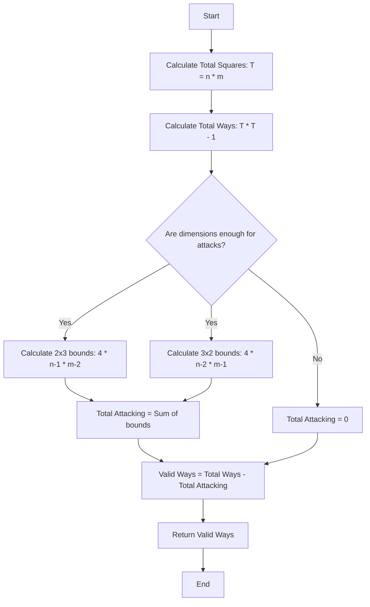

# 💡 Approach — Non-Attacking Black and White Knights

| 📄 [Problem](./Problem.md) | 💡 [Approach](./Approach.md) | 🧩 [Solution](./Solution.cpp) | 🚀 [Main](./Main.cpp) |
|:--------------------------:|:-----------------------------:|:------------------------------:|:---------------------:|

## 📊 Metadata

> [!TIP]
> **Core Insight:** 
> Instead of using an $O(n \times m)$ simulation to manually count non-attacking positions, we can optimize the approach to mathematical combinatorics in $O(1)$ time. Calculate the *total possible placements* for two knights and subtract the *attacking placements*.
> - Total placements = `Total Squares × (Total Squares - 1)`
> - Attacking placements = `4 × (n - 1) × (m - 2) + 4 × (n - 2) × (m - 1)`

## 🔩 Step-by-Step Breakdown
1. **Calculate Total Squares:** Find the total number of squares on the chessboard, which is `n * m`.
2. **Calculate Total Placements:** The first knight can be placed on any of the `n * m` squares, and the second knight can be placed on any of the remaining `(n * m) - 1` squares. Total ways = `(n * m) * (n * m - 1)`.
3. **Calculate Attacking Configurations:** 
   - A knight's attack range forms a `2×3` or a `3×2` bounding box on the board.
   - Number of horizontal L-shapes (`2×3` grids) on an `n×m` board is `(n - 1) * (m - 2)`. In each such grid, there are 2 attacking pairs (4 permutations).
   - Number of vertical L-shapes (`3×2` grids) on an `n×m` board is `(n - 2) * (m - 1)`. In each such grid, there are 2 attacking pairs (4 permutations).
   - Total attacking placements = `4 * (n - 1) * (m - 2) + 4 * (n - 2) * (m - 1)`.
4. **Compute Valid Ways:** Subtract the attacking configurations from the total possible placements: `totalWays - attackingWays`.

## 🔄 Mermaid Flowchart

## 📊 Complexity Analysis
| Complexity | Analysis |
|:---:|:---|
| **Time Complexity** | $$O(1)$$ — We use a direct mathematical formula instead of the expected $O(n \times m)$ loops, computing the result in constant time. |
| **Auxiliary Space** | $$O(1)$$ — No additional memory bounds are allocated. |

> *"The best way to write secure and reliable applications is to write code that is impossible to execute in any other way than what the developer intended."*

---

<h3>Happy Coding! 🚀</h3>

