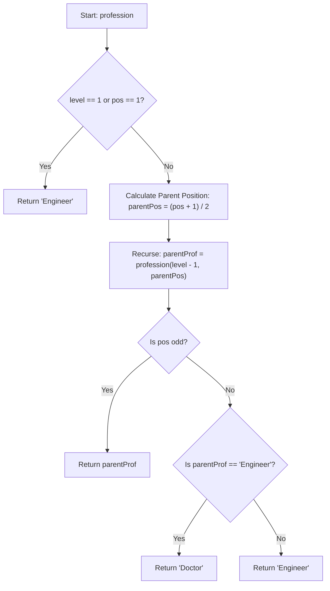

# 💡 Approach — Finding Profession

| 📄 [Problem](./Problem.md) | 💡 [Approach](./Approach.md) | 🧩 [Solution](./Solution.cpp) | 🚀 [Main](./Main.cpp) |
|:--------------------------:|:-----------------------------:|:------------------------------:|:---------------------:|

## 📊 Metadata

> [!TIP]
> **Core Insight:** 
> Instead of building the entire family tree, we can trace the path from the target node up to the root.
> 1. The parent of a node at position `pos` is located at position `(pos + 1) / 2` in the previous level.
> 2. An odd position (`pos % 2 != 0`) indicates the node is a first child, which always shares the **same** profession as its parent.
> 3. An even position (`pos % 2 == 0`) indicates the node is a second child, which always has the **opposite** profession of its parent.
> 
> *Alternative Bitwise Insight:* The profession corresponds to the parity of set bits (1s) in the binary representation of `pos - 1`. An even number of set bits yields `"Engineer"`, whereas an odd number yields `"Doctor"` (this forms the Thue-Morse sequence).

## 🔩 Step-by-Step Breakdown
1. **Base Case:** If `level == 1` or `pos == 1`, return `"Engineer"`. The root is always an Engineer, and the first child of the first child recursively is always an Engineer.
2. **Find Parent's Profession:** Recursively call `profession(level - 1, (pos + 1) / 2)` to determine the parent's profession.
3. **Apply Child Rules:**
   - If `pos` is odd, return the parent's profession unchanged.
   - If `pos` is even, return `"Doctor"` if the parent is `"Engineer"`, and `"Engineer"` if the parent is `"Doctor"`.

## 🔄 Mermaid Flowchart

## 📊 Complexity Analysis
| Complexity | Analysis |
|:---:|:---|
| **Time Complexity** | $$O(\log(pos))$$ — In each recursive call, the position `pos` is halved. The depth of the recursion is bounded by $$\log_2(pos)$$, which takes at most $$30$$ steps since $$pos \le 10^9$$. |
| **Auxiliary Space** | $$O(\log(pos))$$ — The recursion call stack uses space proportional to the depth of recursion (max $$30$$ frames). This is practically $$O(1)$$ and can be fully optimized to $$O(1)$$ space if implemented iteratively. |

> *"Recursion is the process of defining a problem in terms of itself. It is a powerful tool when the problem structure replicates itself at smaller scales."*

---

<h3>Happy Coding! 🚀</h3>

