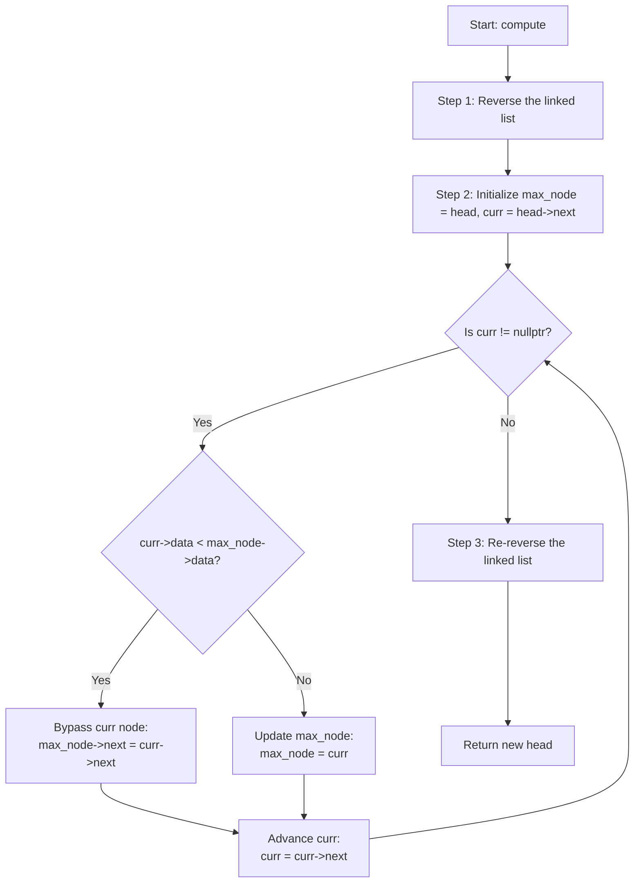

# 💡 Approach — Delete Nodes with Greater on Right

| 📄 [Problem](./Problem.md) | 💡 [Approach](./Approach.md) | 🧩 [Solution](./Solution.cpp) | 🚀 [Main](./Main.cpp) |
|:--------------------------:|:-----------------------------:|:------------------------------:|:---------------------:|

## 📊 Metadata

> [!TIP]
> **Core Insight:**
> A node needs to be deleted if there exists any node with a greater value to its right. Searching from left to right would require $$O(n^2)$$ comparisons in the worst case if done naively, or auxiliary structures like stacks. 
> 
> However, if we look at the list from **right to left**, we only need to keep track of the **maximum value seen so far**. If the current node's value is strictly less than this maximum, it has a greater node to its right and must be deleted. Otherwise, we keep the node and update our maximum. 
> 
> To achieve this in $$O(n)$$ time and $$O(1)$$ auxiliary space:
> 1. **Reverse the list** to allow traversing from right to left.
> 2. **Filter the nodes** in a single pass while tracking the maximum value.
> 3. **Reverse the list again** to restore the original relative order.

## 🔩 Step-by-Step Breakdown

1. **Step 1: Reverse the Linked List**
   - Reverse the original linked list. This allows us to process the elements from right to left.
2. **Step 2: Filter Nodes**
   - Keep a pointer `max_node` to track the node containing the maximum value seen so far (initialized to the new head).
   - Traverse the reversed list using a pointer `curr` starting from `head->next`.
   - If `curr->data < max_node->data`, then `curr` is smaller than a node to its right in the original list. Bypass `curr` by setting `max_node->next = curr->next`, and delete `curr`.
   - If `curr->data >= max_node->data`, `curr` is the new maximum. Update `max_node = curr` and move forward.
3. **Step 3: Re-reverse the Linked List**
   - Reverse the list once more to restore the original order of the remaining elements and return the new head.

## 🔄 Mermaid Flowchart

## 📊 Complexity Analysis

| Complexity | Analysis |
|:---:|:---|
| **Time Complexity** | $$O(n)$$ — Reversing the list takes $$O(n)$$ time. Bypassing nodes and updating the maximum takes a single pass of $$O(n)$$ time. Re-reversing takes $$O(n)$$ time. The overall time complexity is linear. |
| **Auxiliary Space** | $$O(1)$$ — Only a few pointers (`prev`, `curr`, `next`, `max_node`) are used. The operations are performed in-place. |

> *"Sometimes, the simplest way to move forward is to look at things in reverse."*

---

<h3>Happy Coding! 🚀</h3>

