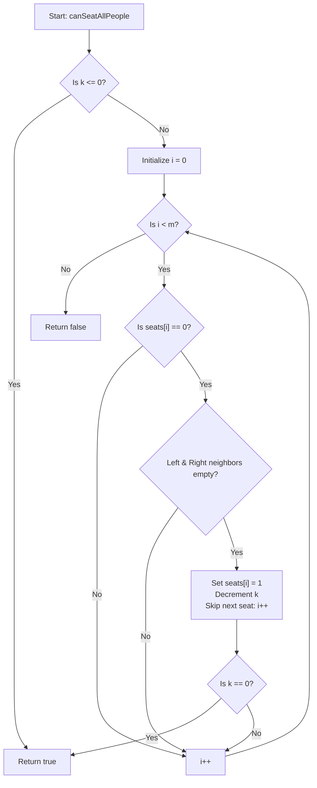

# 💡 Approach — Seating Arrangement

| 📄 [Problem](./Problem.md) | 💡 [Approach](./Approach.md) | 🧩 [Solution](./Solution.cpp) | 🚀 [Main](./Main.cpp) |
|:--------------------------:|:-----------------------------:|:------------------------------:|:---------------------:|

## 📊 Metadata

> [!TIP]
> **Core Insight:**
> To place the maximum number of people without violating the adjacency rule, we can use a **Greedy approach**. By iterating from left to right and placing a person as soon as we find a valid empty seat, we guarantee that we leave as many potential spots open for future seatings as possible.
> 
> A seat at index `i` is valid for seating if and only if:
> 1. The seat itself is empty (`seats[i] == 0`).
> 2. The left neighbor is empty or non-existent (`i == 0 || seats[i - 1] == 0`).
> 3. The right neighbor is empty or non-existent (`i == m - 1 || seats[i + 1] == 0`).
> 
> Once we seat a person at index `i` (by setting `seats[i] = 1`), we decrement `k`. If at any point `k <= 0`, we have successfully seated all people and can return `true` immediately.

## 🔩 Step-by-Step Breakdown

1. **Step 1: Check if `k <= 0`**
   - If the number of people to seat is 0 or less, it's trivially possible. Return `true` immediately.

2. **Step 2: Traverse the Seat Array**
   - Iterate through the array `seats` from index `i = 0` to `m - 1`.
   - At each seat, if `seats[i] == 0`, check the adjacency rules:
     - `left_empty = (i == 0 || seats[i - 1] == 0)`
     - `right_empty = (i == m - 1 || seats[i + 1] == 0)`
   - If both `left_empty` and `right_empty` are `true`, set `seats[i] = 1` to place a person, decrement the remaining people count `k`, and check if `k == 0`.
   - If `k` reaches `0`, return `true` early.
   - Increment `i` additionally (i.e. skip `i + 1`) since the next seat is guaranteed to be adjacent to our newly seated person.

3. **Step 3: Return Result**
   - If we finish traversing the array and `k > 0`, return `false` as it is impossible to seat all people.

## 🔄 Mermaid Flowchart

## 📊 Complexity Analysis

| Complexity | Analysis |
|:---:|:---|
| **Time Complexity** | $$O(m)$$ — We perform a single pass over the seat array of size $$m$$. We also skip checking adjacent seats upon placing a person, which reduces operations. |
| **Auxiliary Space** | $$O(1)$$ — We modify the array in-place and only use a few boolean flags and loop variables, resulting in constant extra memory. |

> *"Simplicity is the soul of efficiency." — Austin Freeman*

---

<h3>Happy Coding! 🚀</h3>

