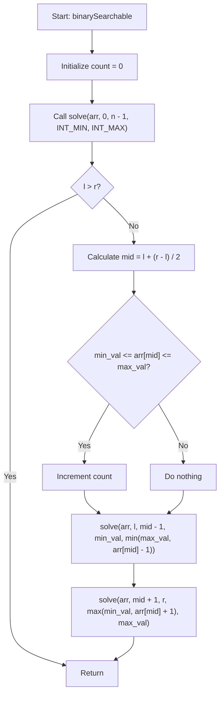

# 💡 Approach — Binary Searchable Count

| 📄 [Problem](./Problem.md) | 💡 [Approach](./Approach.md) | 🧩 [Solution](./Solution.cpp) | 🚀 [Main](./Main.cpp) |
|:--------------------------:|:-----------------------------:|:------------------------------:|:---------------------:|

## 📊 Metadata

> [!TIP]
> **Core Insight:**
> A standard binary search algorithm partition-paths can be modeled as traversing a **Binary Search Tree (BST)**.
> During the binary search for any target element $T$, at each step, we look at $mid$.
> - If $T < arr[mid]$, we must search the left half; hence $T$ must be smaller than $arr[mid]$.
> - If $T > arr[mid]$, we must search the right half; hence $T$ must be larger than $arr[mid]$.
> 
> Instead of executing binary search for every element separately (which takes $$O(n \log n)$$), we can propagate constraints downwards in a single $O(n)$ preorder-like traversal.
> For any range $[l, r]$ with inherited value constraints $[min\_val, max\_val]$:
> - The element at $mid$ is searchable if and only if $min\_val \le arr[mid] \le max\_val$.
> - For the left subarray $[l, mid-1]$, all elements must be smaller than $arr[mid]$, so the upper bound becomes $\min(max\_val, arr[mid] - 1)$.
> - For the right subarray $[mid+1, r]$, all elements must be greater than $arr[mid]$, so the lower bound becomes $\max(min\_val, arr[mid] + 1)$.

## 🔩 Step-by-Step Breakdown

1. **Step 1: Initialize recursive search**
   - We start the recursion with `solve(0, n - 1, INT_MIN, INT_MAX)` to cover the entire array with no initial value restrictions.

2. **Step 2: Check constraints for `arr[mid]`**
   - For the current interval $[l, r]$ and constraints $[min\_val, max\_val]$:
   - Calculate $mid = l + (r - l) / 2$.
   - If `min_val <= arr[mid] && arr[mid] <= max_val`, then `arr[mid]` is searchable. We increment our answer count.

3. **Step 3: Recursive search for left and right halves with updated constraints**
   - Recursively call `solve` for the left half: `l` to `mid - 1`, updating the maximum permissible value to `min(max_val, arr[mid] - 1)`.
   - Recursively call `solve` for the right half: `mid + 1` to `r`, updating the minimum permissible value to `max(min_val, arr[mid] + 1)`.

## 🔄 Mermaid Flowchart

## 📊 Complexity Analysis

| Complexity | Analysis |
|:---:|:---|
| **Time Complexity** | $$O(n)$$ — Every element in the array is visited exactly once as the pivot `mid` of some subtree. |
| **Auxiliary Space** | $$O(\log n)$$ — The recursion stack depth is bounded by the height of the binary search tree, which is $$O(\log n)$$. |

> *"Simplicity is the ultimate sophistication." — Leonardo da Vinci*

---

<h3>Happy Coding! 🚀</h3>

