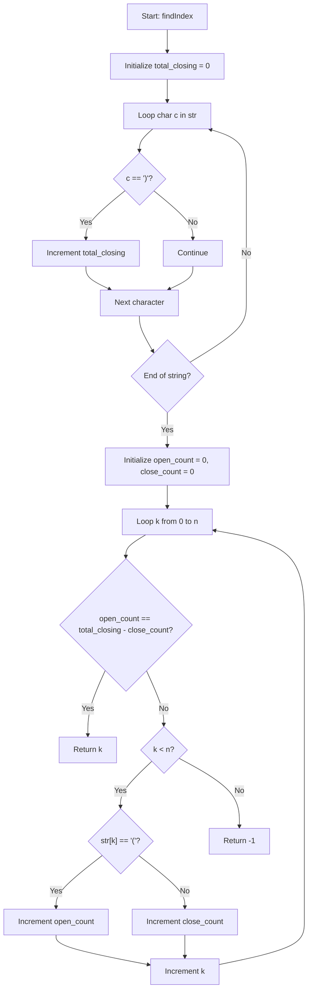

# 💡 Approach — Equal Point in Brackets

| 📄 [Problem](./Problem.md) | 💡 [Approach](./Approach.md) | 🧩 [Solution](./Solution.cpp) | 🚀 [Main](./Main.cpp) |
|:--------------------------:|:-----------------------------:|:------------------------------:|:---------------------:|

## 📊 Metadata

> [!TIP]
> **Core Insight:**
> For any split point $k$ (where $0 \le k \le n$):
> - The left part of the string has length $k$.
> - The number of characters in the left part is the sum of opening brackets and closing brackets in it: $\text{open\_count\_left} + \text{close\_count\_left} = k$.
> - The right part has closing brackets equal to: $\text{close\_count\_right} = \text{total\_closing} - \text{close\_count\_left}$.
> - We want $\text{open\_count\_left} = \text{close\_count\_right}$, which is:
>   $$\text{open\_count\_left} = \text{total\_closing} - \text{close\_count\_left}$$
>   $$\implies \text{open\_count\_left} + \text{close\_count\_left} = \text{total\_closing}$$
>   $$\implies k = \text{total\_closing}$$
> 
> Thus, the equal point $k$ is always mathematically equal to the total count of closing brackets `)` in the entire string!
> Although returning this count directly is $O(n)$ time and $O(1)$ space, we can also simulate the step-by-step verification to find the exact point explicitly, maintaining a clear algorithmic flow.

## 🔩 Step-by-Step Breakdown

1. **Step 1: Count total closing brackets**
   - Traverse the string once to count the total number of closing brackets `)` in the string. Let this count be `total_closing`.

2. **Step 2: Iterate to find the equal point**
   - Traverse the string from $k = 0$ to $n$ while tracking the number of opening brackets `open_count` and closing brackets `close_count` encountered so far.
   - At each step $k$, check if the opening brackets on the left (`open_count`) equals the closing brackets remaining on the right (`total_closing - close_count`).
   - If equal, return $k$. Otherwise, update the counters based on the character at index $k$ and continue.

## 🔄 Mermaid Flowchart

## 📊 Complexity Analysis

| Complexity | Analysis |
|:---:|:---|
| **Time Complexity** | $$O(n)$$ — We traverse the string twice (once to count closing brackets, and once to find the index). |
| **Auxiliary Space** | $$O(1)$$ — We use a constant amount of extra memory for counters. |

> *"Elegant code is not code that does the job; it is code that does it with such simplicity that the solution seems obvious in hindsight."* — Unknown

---

<h3>Happy Coding! 🚀</h3>

