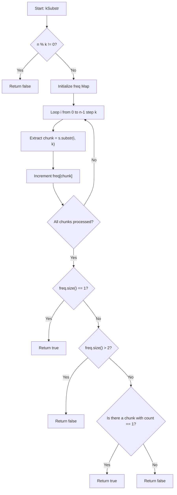

# 💡 Approach — Check Repeated Substring with K Replacements

| 📄 [Problem](./Problem.md) | 💡 [Approach](./Approach.md) | 🧩 [Solution](./Solution.cpp) | 🚀 [Main](./Main.cpp) |
|:--------------------------:|:-----------------------------:|:------------------------------:|:---------------------:|

## 📊 Metadata

> [!TIP]
> **Core Insight:**
> If the string length $n$ is not divisible by $k$, it's impossible to make $s$ a repetition of $k$-length substrings.
> Otherwise, we partition the string $s$ into $n/k$ chunks of length $k$. For the string to be converted into a perfect repetition by replacing at most one chunk:
> 1. There can be at most **2** distinct kinds of chunks in the entire string.
> 2. If there is only **1** distinct chunk, it is already a repetition.
> 3. If there are exactly **2** distinct chunks, we must be able to convert one into the other. This is only possible if one of the chunks appears exactly **once** (frequency of 1). Replacing that single outlier makes all chunks identical.

## 🔩 Step-by-Step Breakdown

1. **Step 1: Check Divisibility**
   - Check if $n \pmod k \ne 0$. If so, return `false`, as we cannot partition the string into equal chunks of size $k$.

2. **Step 2: Partition and Count Frequencies**
   - Traverse the string in steps of $k$ from $i = 0$ to $n-1$.
   - Extract the substring of length $k$ starting at $i$.
   - Store and increment its count in a frequency map (`freq`).

3. **Step 3: Analyze Substring Frequencies**
   - If `freq.size() == 1`, return `true`.
   - If `freq.size() > 2`, return `false` since we would need more than one replacement.
   - If `freq.size() == 2`, iterate through the frequency map and check if either of the two unique substrings has a frequency count equal to `1`. If so, return `true`; otherwise, return `false`.

## 🔄 Mermaid Flowchart

## 📊 Complexity Analysis

| Complexity | Analysis |
|:---:|:---|
| **Time Complexity** | $$O(n)$$ — We traverse the string of length $n$ once in blocks of size $k$ to extract substrings. Substring comparison and hashing takes $O(k)$ per step, leading to an overall time complexity of $O(n/k \cdot k) = O(n)$. |
| **Auxiliary Space** | $$O(n)$$ — In the worst case, we store the substrings of size $k$ in a hash map. The number of entries is at most $n/k$, with each key taking $O(k)$ space, resulting in $O(n)$ space complexity. |

> *"Simplicity is the soul of efficiency."* — Austin Freeman

---

<h3>Happy Coding! 🚀</h3>

